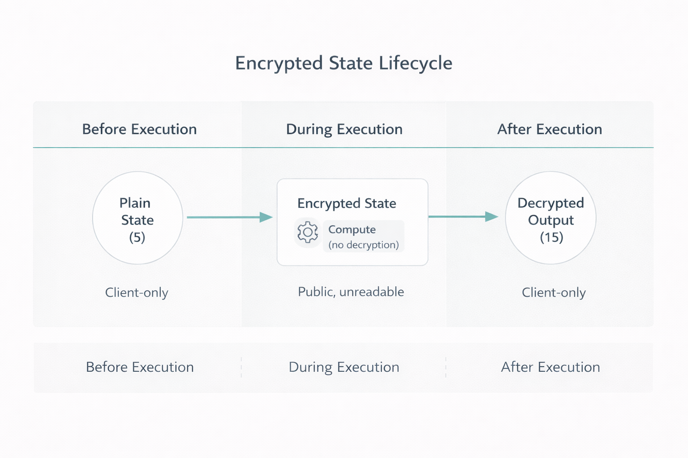
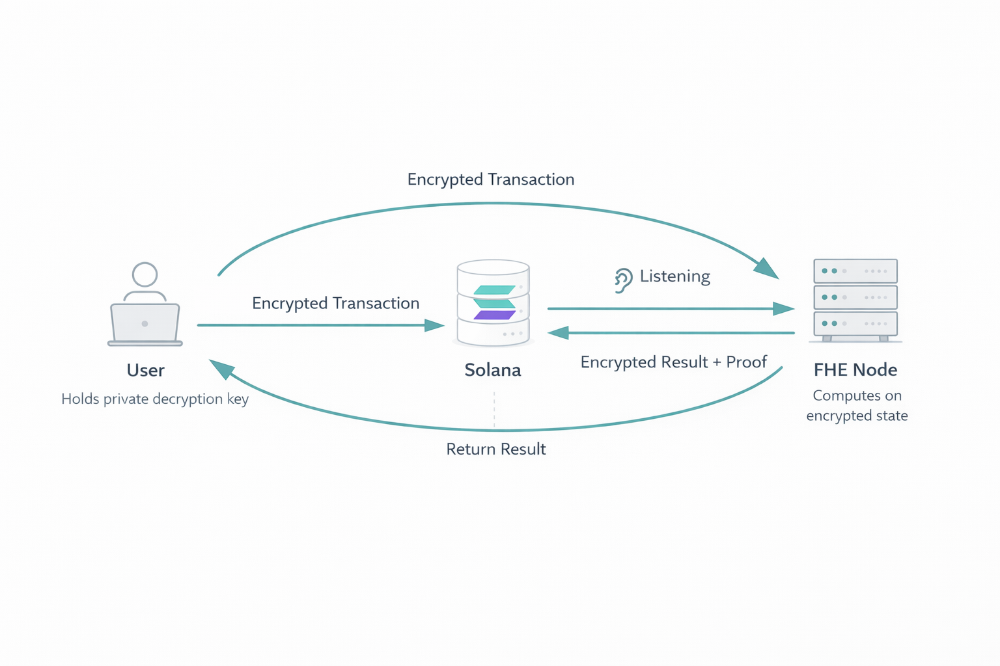

# 🛡️ FHESTATE

### *CONFIDENTIAL COMPUTING ON SOLANA*

> **"Data should be seen by its owner, not by the node."**

[](https://github.com/fhestate/fhestate-rs)
[](https://solana.com)
[](https://github.com/zama-ai/tfhe-rs)
[](LICENSE)

[**Quick Start**](docs/QUICKSTART.md) • [**Architecture**](docs/ARCHITECTURE.md) • [**Examples**](docs/EXAMPLES.md)

</div>

---

## 🌟 Overview

**FHESTATE** is the first practical implementation of Fully Homomorphic Encryption (FHE) integrated with Solana blockchain. It enables **private computation with public verification** - allowing you to perform computations on encrypted data while posting cryptographic proofs to Solana for transparency and auditability.

### What Makes FHESTATE Unique?

- 🔒 **True Privacy**: Compute on encrypted data using TFHE (Fully Homomorphic Encryption)
- ⛓️ **Blockchain Verified**: Post cryptographic proofs to Solana for public verification
- 🚀 **Production Ready**: Working implementation with real on-chain transactions
- 📊 **Transparent**: All computations are verifiable through SHA256 hashes and blockchain receipts

---

## 🔮 The Concept: Public Verification, Private Data

FHESTATE enables a new paradigm: **Trustless Confidential Computing**. 

Unlike Zero-Knowledge Proofs (which prove a statement *about* data), **Full Homomorphic Encryption (FHE)** allows the blockchain to actually *process* the data without ever seeing it.

### High-Level Overview



---

## 🎯 Use Cases

- **Private Voting**: Vote on encrypted ballots, count votes homomorphically
- **Sealed-Bid Auctions**: Submit encrypted bids, determine winner without revealing bids
- **Confidential Trading**: Execute trades on encrypted order books
- **Privacy-Preserving Analytics**: Compute statistics on encrypted datasets
- **Secure Multi-Party Computation**: Collaborative computation without revealing inputs

---

## 🏗️ Architecture

### System Architecture



### Technical Workflow

The FHESTATE protocol enables a **Trustless Confidential Computing** cycle:

1.  **Client-Side Encryption**: Inputs are encrypted locally using TFHE (Zama). The private key *never* leaves the client.
2.  **Provenance Verification**: A SHA256 hash of the ciphertext is posted to Solana to prove the data's existence and immutability at a specific block time.
3.  **Encrypted Execution**: The `fhe-node` observes the chain, retrieves the encrypted payload, and performs mathematical operations (e.g., addition, logic) *blindly* on the ciphertexts.
4.  **Verifiable Result**: The node generates a new ciphertext result and posts its cryptographic proof back to the chain.
5.  **Owner Decryption**: Only the original user (holder of the private key) can decrypt the result.

### 2. Key Management & Roles

Understanding who holds the keys is crucial for the security model.


**Learn more:** [Architecture Documentation](docs/ARCHITECTURE.md)

---

## 🚀 Quick Start

### Prerequisites

- **Rust**: 1.70 or higher
- **Solana CLI**: 1.18 or higher
- **Node.js**: 16+ (optional, for examples)

### Installation

```bash
# Clone the repository
git clone https://github.com/fhestate/fhestate-rs.git
cd fhestate-rs

# Build the project
cargo build --release
```

### 1. Generate FHE Keys (Use release mode for speed)
```bash
cargo run --release --bin fhe_proof -- keygen
```

### 2. Run FHE Demo
```bash
cargo run --release --bin fhe_proof -- demo
```

### 3. Submit to Solana (Default Program)
```bash
# Uses our deployed program on Devnet - works immediately!
cargo run --bin fhe-cli -- submit --op 1
```

---

## 🔧 Program Deployment Options

FHESTATE offers **two deployment options**:

### Option 1: Use Default Program (Recommended for Quick Start) ✅

**No deployment needed** - the SDK uses a pre-deployed Coordinator program on Solana Devnet.

**Advantages:**
- ⚡ Instant start - no setup required
- 🎯 Perfect for testing, demos, hackathons
- 📚 All documentation examples work out-of-box
- 🆓 Free to use on Devnet

**Default Program ID:** `MemoSq4gqABAXKb96qnH8TysNcWxMyWCqXgDLGmfcHr` (SPL Memo for demo)

---

### Option 2: Deploy Your Own Program (Advanced) 🔒

For **production use or custom modifications**, deploy your own instance:

```bash
# Build the program
cd programs/coordinator
cargo build-bpf

# Deploy to Devnet
solana program deploy target/deploy/coordinator.so

# Note the Program ID from output
# Example: Program Id: 7xKH...9pQ2
```

**Use your Program ID:**
```bash
cargo run --bin fhe-cli -- submit \
    --program YOUR_PROGRAM_ID \
    --op 1
```

**Advantages:**
- 🔐 Full control and ownership
- ⚙️ Customize program logic
- 🏗️ True decentralization
- 🚀 Production-ready for Mainnet

**When to deploy your own:**
- Production applications
- Need custom FHE operations
- Privacy/security requirements
- Mainnet deployment

---

## 📦 Components

### 1. **fhe-cli** - Command Line Interface
Submit FHE tasks to Solana blockchain.

```bash
cargo run --bin fhe-cli -- submit --op 1
```

### 2. **fhe-node** - Background Executor
Listen for and process FHE tasks from blockchain.

```bash
cargo run --bin fhe-node
```

### 3. **fhe_proof** - Standalone Demo
Generate FHE keys and run local demonstrations.

```bash
cargo run --release --bin fhe_proof -- demo
```

**Full API:** [API Documentation](docs/API.md)

---

## 📚 Documentation

| Document | Description |
|----------|-------------|
| [Quick Start Guide](docs/QUICKSTART.md) | Get up and running in 5 minutes |
| [Architecture Overview](docs/ARCHITECTURE.md) | Deep dive into system design |
| [API Reference](docs/API.md) | Complete API documentation |
| [Examples](docs/EXAMPLES.md) | Code examples and tutorials |
| [Contributing](docs/CONTRIBUTING.md) | How to contribute to the project |
| [FAQ](docs/FAQ.md) | Frequently asked questions |

---

## 🎓 How It Works

### 1. **Encryption** (Client-Side)
```rust
let ct = FheUint8::encrypt(42, &client_key);
// Data is now encrypted, ready for computation
```

### 2. **Homomorphic Computation** (Server-Side)
```rust
let ct_plus_one = server_key.add(&ct, &FheUint8::encrypt(1, &client_key));
// Computation happens on encrypted data!
```

### 3. **Blockchain Proof** (On-Chain)
```rust
let mut hasher = Sha256::new();
hasher.update(&bincode::serialize(&ct)?);
let proof = hasher.finalize();
// Post proof to Solana
```

### 4. **Decryption & Verification** (Client-Side)
```rust
let result: u8 = ct_plus_one.decrypt(&client_key);
assert_eq!(result, 43); // ✅ Verified!
```

**Detailed explanation:** [Architecture Documentation](docs/ARCHITECTURE.md)

---

## 🔬 Example: Private Addition

```rust
use fhestate_rs::*;

// 1. Generate keys
let (client_key, server_key) = generate_keys();

// 2. Encrypt inputs
let a = FheUint8::encrypt(15, &client_key);
let b = FheUint8::encrypt(27, &client_key);

// 3. Compute on encrypted data
set_server_key(server_key);
let result = a + b;

// 4. Decrypt and verify
let plaintext: u8 = result.decrypt(&client_key);
assert_eq!(plaintext, 42); // ✅ 15 + 27 = 42
```

**More examples:** [Examples Documentation](docs/EXAMPLES.md)

---

## 🌐 Verified Transactions

Here are real, verified FHE transactions on Solana Devnet:

| Date | Operation | Transaction Hash | Status |
|------|-----------|------------------|--------|
| 2026-01-28 | FHE Task Submission | [`4w9MESyqbMTkvNZAVn1uLBz1tD8onSuwEqh4yjaxrZLaUvKM7Wf63etQcjvC6XMuRso7auGpH6chFQC6YGyAJ41f`](https://explorer.solana.com/tx/4w9MESyqbMTkvNZAVn1uLBz1tD8onSuwEqh4yjaxrZLaUvKM7Wf63etQcjvC6XMuRso7auGpH6chFQC6YGyAJ41f?cluster=devnet) | ✅ Confirmed |
| 2026-01-28 | Input: "SKD is ready" | [`454d1RTd6vbriUF46JLbomNZuX65aRMxuLDGmqWAq7oDUgFqaAtspsRdTj9yz6ofbwAA7uKrnuDxDKhE7Nw4X2v4`](https://explorer.solana.com/tx/454d1RTd6vbriUF46JLbomNZuX65aRMxuLDGmqWAq7oDUgFqaAtspsRdTj9yz6ofbwAA7uKrnuDxDKhE7Nw4X2v4?cluster=devnet) | ✅ Confirmed |

All transactions are **publicly verifiable** on Solana Explorer.

---

## 📊 Performance

| Operation | Time (avg) | Notes |
|-----------|-----------|-------|
| Key Generation | ~10s | One-time setup |
| Encryption (per byte) | ~50ms | Client-side |
| Addition (encrypted) | ~100ms | Server-side |
| Decryption (per byte) | ~50ms | Client-side |
| Blockchain Submission | ~13s | Network dependent |

**Note**: FHE operations are computationally intensive. This is a fundamental tradeoff for achieving perfect privacy.

---

## 🏰 Security & Assurance

FHESTATE is built on **cutting-edge cryptographic primitives** and is currently in its **Devnet Beta** phase.

### Core Security Model
*   **Privacy by Design**: Data remains encrypted at all times—during transit, storage, and *even during computation*.
*   **Trust Minimization**: The server/node never sees private keys. It operates blindly on data it cannot read.
*   **Auditable History**: Every step of the computation leaves an immutable trace on the Solana blockchain.

> [!NOTE]
> This SDK is currently optimized for **research and development**. While the FHE cryptography (TFHE-rs) is production-grade, the coordination layer is currently in Beta. For high-value Mainnet deployments, we recommend contacting our team for a tailored security review.

---

## 📜 License

This project is licensed under the MIT License - see the [LICENSE](LICENSE) file for details.

---

## 🙏 Acknowledgments

- **Zama**: For the incredible [TFHE-rs](https://github.com/zama-ai/tfhe-rs) library
- **Solana**: For the high-performance blockchain infrastructure
- **Rust Community**: For amazing tooling and ecosystem

---

## 📞 Contact & Support

- **GitHub Issues**: [Report bugs or request features](https://github.com/fhestate/fhestate-rs/issues)
- **Discussions**: [Join community discussions](https://github.com/fhestate/fhestate-rs/discussions)
- **Twitter**: [@fhe_state](https://twitter.com/fhe_state)

---

<div align="center">

Copyright © 2026 FHESTATE Protocol. All rights reserved.

</div>
