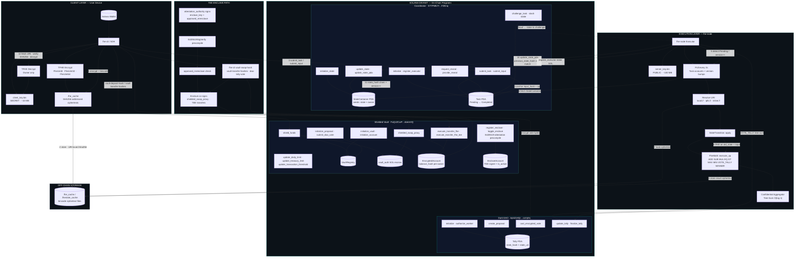
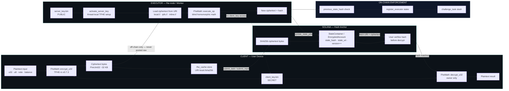

# 🛡️ FHESTATE

### *THE PRIVACY LAYER FOR AUTONOMOUS AI AGENTS ON SOLANA*

> **"Private Intelligence. Public Settlement."**

[](https://github.com/fhestate/fhestate-rs)
[](https://solana.com)
[](https://github.com/zama-ai/tfhe-rs)
[](LICENSE)

[**Quick Start**](docs/QUICKSTART.md) • [**Documentation**](https://docs.fhestate.org) • [**API Reference**](docs/API.md) • [**Examples**](docs/EXAMPLES.md) • [**Buy FHESTATE**](https://pump.fun/coin/4cfEdG5Z814n3SvJYBDvvHg3VVFmRDgVqKUdaganpump)

---

## Overview

**FHESTATE** is the privacy layer for autonomous AI agents on Solana. Built on [TFHE-rs](https://github.com/zama-ai/tfhe-rs), it lets agents compute, coordinate, and transact on encrypted state without exposing prompts, balances, memory, strategies, or intent. Solana delivers speed and composability for settlement; transparent chains leak the intelligence that makes agents valuable. FHESTATE closes that gap with encryption at the edge, confidential FHE agents (Sentinel, Auditor, and Coordinator running blind steps on six Devnet missions), hash-linked confidential memory, and on-chain proof verifiable on Solscan without plaintext. The broader stack includes **fhestate-sdk** for browser TFHE and Solana clients, **fhestate-mcp** for Model Context Protocol agent orchestration, and [fhestate.org](https://fhestate.org) for architecture and security — confidential computing, decentralized compute, and autonomous agents as one product.

**`fhestate-rs`** is the Rust core in this repository. It ships three Devnet Anchor programs - **Coordinator** (hash-chained `StateContainer` PDAs, task queue, executor staking), **Dark DAO** (encrypted ballots and homomorphic tally commitments), and **Shielded Vault** (confidential SOL custody, balance hash commitments, TEE enclave attestation). Off-chain, **`fhe-cli`** handles encryption and vault hash helpers; **`fhe-node`** runs decentralized compute - polling Devnet, resolving cache URIs, executing homomorphic math with the public server key, and posting state updates without decrypting user data. `fhe_proof` and integration binaries verify the full stack end to end; TypeScript SDK layouts mirror program PDAs and discriminators for integrators.

The model is hybrid: ciphertext bytes live off-chain in `.fhe_cache`; Solana anchors SHA-256 commitments, URI pointers, and versioned PDAs. FHE executes computation on ciphertext directly - unlike zero-knowledge proofs that only attest to a result. Only the client key holder decrypts; the executor sees lattice noise. That binds confidential computing, decentralized `fhe-node` execution, and blind agent workflows to one verifiable ledger. Diagrams, flows, and setup follow below - see [Architecture](docs/ARCHITECTURE.md) and [Quick Start](docs/QUICKSTART.md).

---

## Full System Architecture

Complete FHESTATE topology: client encryption, three on-chain programs, executor polling, cache resolution, TEE attestation, and owner-only decryption.


```mermaid
flowchart TB
    subgraph CLIENT["CLIENT LAYER — User Device"]
        direction TB
        WALLET[("Solana Wallet")]
        CLI["fhe-cli / SDK"]
        CKEY["client_key.bin<br/>SECRET · ~10 MB"]
        ENC["TFHE Encrypt<br/>FheUint8 · FheUint32 · FheUint64"]
        DEC["TFHE Decrypt<br/>Owner only"]
        CACHE_CLI[".fhe_cache<br/>SHA256-addressed ciphertexts"]
        WALLET --> CLI
        CLI --> CKEY
        CLI --> ENC
        ENC --> CACHE_CLI
        DEC --> CKEY
    end

    subgraph CHAIN["SOLANA DEVNET — On-Chain Programs"]
        direction TB

        subgraph COORD["Coordinator · 57YPM8JY…FZEnq"]
            direction TB
            REG_INIT["initialize · register_executor"]
            SUBMIT["submit_task · submit_input"]
            STATE_INIT["initialize_state"]
            UPDATE["update_state · update_state_pda"]
            REVEAL["request_reveal · provide_reveal"]
            CHALLENGE["challenge_task · slash stake"]
            PDA_STATE[("StateContainer PDA<br/>seeds: state + owner")]
            PDA_TASK[("Task PDA<br/>Pending → Completed")]
            REG_INIT --> PDA_TASK
            SUBMIT --> PDA_TASK
            STATE_INIT --> PDA_STATE
            UPDATE --> PDA_STATE
            REVEAL --> PDA_TASK
            CHALLENGE --> PDA_TASK
        end

        subgraph DAO["Dark DAO · Ay5Z1HQr…ocVp5s"]
            direction TB
            DAO_INIT["initialize · authorize_worker"]
            PROP["create_proposal"]
            VOTE["cast_encrypted_vote"]
            TALLY["update_tally · finalize_tally"]
            PDA_TALLY[("Tally PDA<br/>state_hash + state_uri")]
            DAO_INIT --> PDA_TALLY
            PROP --> PDA_TALLY
            VOTE --> PDA_TALLY
            TALLY --> PDA_TALLY
        end

        subgraph VAULT["Shielded Vault · FuQzZCwP…domeVQ"]
            direction TB
            V_INIT["initialize_vault · initialize_account"]
            SHIELD["shield_funds"]
            TRANSFER["execute_transfer_fhe · execute_transfer_fhe_tee"]
            LIMITS["update_daily_limit · update_treasury_limit<br/>update_transaction_threshold"]
            ENCL_REG["register_enclave · toggle_enclave<br/>Ed25519 attestation precompile"]
            SWAP["shielded_swap_proxy"]
            GOV["initialize_proposal · submit_dao_vote"]
            PDA_REG[("VaultRegistry")]
            PDA_VAULT[("vault_auth SOL escrow")]
            PDA_ENC[("EncryptedAccount<br/>balance_hash per owner")]
            PDA_ENCL[("EnclaveAccount<br/>TEE signer + is_active")]
            V_INIT --> PDA_REG
            V_INIT --> PDA_ENC
            SHIELD --> PDA_VAULT
            SHIELD --> PDA_REG
            TRANSFER --> PDA_ENC
            ENCL_REG --> PDA_ENCL
            SWAP --> PDA_ENC
            SWAP --> PDA_VAULT
            GOV --> PDA_REG
        end
    end

    subgraph EXEC["EXECUTION LAYER — fhe-node"]
        direction TB
        NODE["fhe-node Executor"]
        SKEY["server_key.bin<br/>PUBLIC · ~100 MB"]
        POLL["Poll every 2s<br/>Task accounts + version bumps"]
        RESOLVE["Resolve URI<br/>local:// · ipfs:// · inline://"]
        TRANS["StateTransition::apply"]
        MATH["FheMath::execute_op<br/>ADD SUB MUL EQ GT MAX MIN VOTE_TALLY WINNER"]
        AGG["Confidential Aggregator<br/>Tree-Sum O(log n)"]
        NODE --> SKEY
        NODE --> POLL
        POLL --> RESOLVE
        RESOLVE --> TRANS
        TRANS --> MATH
        MATH --> AGG
    end

    subgraph TEE["TEE ENCLAVE PATH"]
        direction TB
        ATTEST["attestation_authority signs<br/>enclave_key + approved_mrenclave"]
        ED25519["Ed25519SigVerify precompile"]
        MRENCLAVE["approved_mrenclave check"]
        ENCL_SIGN["Enclave co-signs<br/>shielded_swap_proxy · TEE transfers"]
        VHASH["fhe-cli vault-swap-hash<br/>vault-transfer-hashes · dao-tally-vote"]
        ATTEST --> ED25519
        ED25519 --> MRENCLAVE
        MRENCLAVE --> ENCL_SIGN
        VHASH --> ENCL_SIGN
    end

    subgraph CACHE["OFF-CHAIN STORAGE"]
        LCACHE[(".fhe_cache / .fhestate_cache<br/>bincode ciphertext files")]
    end

    %% Coordinator lifecycle
    CLI -->|"1 encrypt + bincode"| CACHE_CLI
    CACHE_CLI -->|"2 store · URI local://sha256"| LCACHE
    CLI -->|"3 submit_task / submit_input"| SUBMIT
    SUBMIT -->|"4 anchor input_hash + op"| PDA_TASK
    NODE -->|"5 detect Pending / version++"| POLL
    POLL -->|"6 fetch StateContainer"| PDA_STATE
    RESOLVE -->|"7 load ciphertext"| LCACHE
    TRANS -->|"8 FHE on old_state + input"| MATH
    MATH -->|"9 store result ciphertext"| LCACHE
    NODE -->|"10 update_state_pda<br/>previous_state_hash must match"| UPDATE
    UPDATE -->|"11 state_hash chain + version++"| PDA_STATE
    CLI -->|"12 fetch URI · verify SHA256 · decrypt"| DEC

    %% Dark DAO path
    CLI -->|"encrypt vote bytes"| VOTE
    NODE -->|"VOTE_TALLY tree-sum"| TALLY
    AGG --> TALLY

    %% Shielded Vault path
    CLI -->|"vault-deposit-hash / vault-transfer-hashes"| SHIELD
    CLI --> VHASH
    ENCL_SIGN --> SWAP
    ENCL_SIGN --> TRANSFER
    VHASH --> PDA_ENC

    %% Staking
    NODE -->|"register_executor stake SOL"| REG_INIT
    CHALLENGE -.->|"fraud → stake to challenger"| NODE

    style CLIENT fill:#0c1218,stroke:#3A8C85,color:#FCFAF5
    style CHAIN fill:#0c1218,stroke:#0D9488,color:#FCFAF5
    style EXEC fill:#0c1218,stroke:#3A8C85,color:#FCFAF5
    style TEE fill:#0c1218,stroke:#0D9488,color:#FCFAF5
    style CACHE fill:#0c1218,stroke:#64748B,color:#FCFAF5
    style COORD fill:#0F172A,stroke:#3A8C85,color:#FCFAF5
    style DAO fill:#0F172A,stroke:#0D9488,color:#FCFAF5
    style VAULT fill:#0F172A,stroke:#3A8C85,color:#FCFAF5
```

### Architecture at a glance

| Layer | Components | Trust boundary |
|-------|------------|----------------|
| **Client** | Wallet, `fhe-cli`, `client_key.bin`, local cache | User holds decryption capability |
| **Chain** | Coordinator, Dark DAO, Shielded Vault + PDAs | Immutable ordering, hash anchors, policy enforcement |
| **Execution** | `fhe-node`, `server_key.bin`, `StateTransition` | Blind compute — cannot decrypt |
| **TEE** | Enclave registration, attestation, co-signed vault ops | Hardware-measured signer for high-value vault paths |

**Deployed Devnet program IDs**

| Program | ID | Source |
|---------|-----|--------|
| Coordinator | `57YPM8JYv8t6wArmZTD14PNo6ES9CYKGRYcZWC4FZEnq` | `programs/coordinator` |
| Dark DAO | `Ay5Z1HQrsfnYNhRt48Mujr7k1b91bV7ir4jATYocVp5s` | `programs/dark_dao` |
| Shielded Vault | `FuQzZCwPSRSVLT9gCgcft43a4RkapBJmSTC6CmdomeVQ` | `programs/shielded_vault` |

Deep dive: [Architecture](docs/ARCHITECTURE.md) · [Shielded Vault](docs/SHIELDED-VAULT-PROGRAM.md) · [Decentralized Compute](docs/DECENTRALIZED-COMPUTE.md)

---

## End-to-End Flows

### Coordinator: private state machine

The Coordinator program is the core FHE task orchestrator. Every user gets a deterministic `StateContainer` PDA (`seeds = [b"state", owner]`).

1. **Encrypt** — `fhe-cli` encrypts input to `FheUint32`, serializes with `bincode`, stores in `.fhe_cache/<sha256>.bin`.
2. **Submit** — `submit_task` posts `input_hash`, `local://<sha256>` URI, and operation code. Or `submit_input` for inline fast-path (small payloads).
3. **Poll** — `fhe-node` detects new `Task` accounts or `StateContainer.version` bumps every 2 seconds.
4. **Resolve** — Node loads old state + input ciphertexts from cache via URI (`local://`, `ipfs://`, `inline://`).
5. **Compute** — `StateTransition::apply()` runs `FheMath::execute_op()` homomorphically using `server_key.bin`.
6. **Settle** — `update_state_pda` requires `previous_state_hash == state_container.state_hash`. On mismatch → `StateHashMismatch`. Version increments; rollback is impossible.
7. **Verify & decrypt** — User fetches ciphertext from cache, checks `SHA256(bytes) == on-chain state_hash`, decrypts with `client_key.bin`.

```rust
// programs/coordinator — hash chain enforcement
require!(
    state_container.state_hash == previous_state_hash,
    CoordinatorError::StateHashMismatch
);
```

### Shielded Vault: confidential SOL + TEE

Balances are **hash commitments** on-chain, not plaintext or 32 KB ciphertexts. SOL sits in the `vault_auth` PDA.

| Step | Actor | Action |
|------|-------|--------|
| 1 | User | `initialize_account` → `EncryptedAccount` PDA |
| 2 | User | `shield_funds` — SOL → vault, `total_liquidity += amount` |
| 3 | Off-chain | `fhe-cli vault-deposit-hash` → homomorphic new balance → `new_balance_hash` |
| 4 | Admin / Enclave | Post hash via `execute_transfer_fhe_tee` or transfer instruction |
| 5 | Admin | Set `approved_mrenclave`, `attestation_authority`, daily/treasury limits |
| 6 | TEE | `register_enclave` with Ed25519 attestation at prior instruction index |
| 7 | User + Enclave | `shielded_swap_proxy(amount_in, min_out, new_balance_hash)` |

### Dark DAO: encrypted governance

| Step | Actor | Action |
|------|-------|--------|
| 1 | Authority | `initialize` + `authorize_worker` for FHE executor |
| 2 | Creator | `create_proposal` → `Tally` PDA |
| 3 | Voter | `cast_encrypted_vote` — encrypted ballot bytes on-chain |
| 4 | Worker | `fhe-cli dao-tally-vote` → tree-sum `VOTE_TALLY` off-chain |
| 5 | Worker | `update_tally` writes `state_hash` + `state_uri` to tally PDA |
| 6 | Worker | `finalize_tally` commits result; individual votes stay encrypted |

Tree-sum aggregation keeps noise growth at **O(log n)** — tallies remain decryptable after 1000+ votes.

---

## Cryptographic Key Model

FHESTATE uses TFHE-rs **dual-key cryptography**. The client key controls who can read data; the server key controls who can compute on encrypted data. They are intentionally separated — possession of `server_key.bin` does not grant decryption capability.

### Key roles

| Key | File | Visibility | Held by | Size | Can do | Cannot do |
|-----|------|-----------|---------|------|--------|-----------|
| **Client key** | `fhe_keys/client_key.bin` | SECRET | User device only | ~10 MB | Encrypt plaintext, decrypt results | Run homomorphic ops without server key |
| **Server key** | `fhe_keys/server_key.bin` | PUBLIC | `fhe-node`, workers, TEE | ~100 MB | ADD, SUB, MUL, comparisons, tree-sum | Decrypt any ciphertext |

Generated once via `cargo run --release --bin fhe_proof -- keygen`. The server key is safe to distribute to executors; the client key must never leave the user's machine.

### Key lifecycle flow


```mermaid
flowchart LR
    subgraph USER["CLIENT — User Device"]
        direction TB
        PLAIN["Plaintext input<br/>u32 · u8 · vote · balance"]
        CKEY["client_key.bin<br/>SECRET"]
        ENC_OP["FheMath::encrypt_u32<br/>TFHE-rs v0.7.3"]
        CT_OUT["Ciphertext bytes<br/>FheUint32 ~32 KB"]
        CACHE_W[".fhe_cache store<br/>URI local://sha256"]
        DEC_OP["FheMath::decrypt_u32<br/>owner only"]
        PLAIN_OUT["Plaintext result"]
        PLAIN --> ENC_OP
        CKEY --> ENC_OP
        ENC_OP --> CT_OUT
        CT_OUT --> CACHE_W
        DEC_OP --> PLAIN_OUT
        CKEY --> DEC_OP
    end

    subgraph CHAIN_ANCHOR["SOLANA — Hash Anchor"]
        direction TB
        HASH["SHA256 ciphertext bytes"]
        PDA["StateContainer / EncryptedAccount<br/>state_hash · state_uri · version++"]
        VERIFY["User verifies hash<br/>before decrypt"]
        HASH --> PDA
        PDA --> VERIFY
    end

    subgraph EXECUTOR["EXECUTOR — fhe-node / Worker"]
        direction TB
        SKEY["server_key.bin<br/>PUBLIC"]
        ACTIVATE["activate_server_key<br/>thread-local TFHE setup"]
        LOAD["Load ciphertext from URI<br/>local:// · ipfs:// · inline://"]
        FHE["FheMath::execute_op<br/>blind homomorphic math"]
        RESULT["New ciphertext + hash"]
        SKEY --> ACTIVATE
        ACTIVATE --> LOAD
        LOAD --> FHE
        FHE --> RESULT
    end

    subgraph GUARDS["ON-CHAIN ENFORCEMENT"]
        direction TB
        PREV["previous_state_hash check"]
        STAKE["register_executor stake"]
        SLASH["challenge_task slash"]
        PREV --- STAKE
        STAKE --- SLASH
    end

    CACHE_W -->|"submit_task / submit_input"| HASH
    CT_OUT -->|"off-chain only — never posted raw"| LOAD
    RESULT -->|"update_state_pda"| PDA
    PDA -->|"fetch URI + ciphertext"| VERIFY
    VERIFY -->|"hash matches"| DEC_OP
    FHE -.->|"no client_key access"| CKEY
    RESULT --> PREV

    style USER fill:#0c1218,stroke:#3A8C85,color:#FCFAF5
    style CHAIN_ANCHOR fill:#0c1218,stroke:#0D9488,color:#FCFAF5
    style EXECUTOR fill:#0c1218,stroke:#3A8C85,color:#FCFAF5
    style GUARDS fill:#0F172A,stroke:#64748B,color:#FCFAF5
```

### What each party sees

| Party | Sees on-chain | Sees off-chain | Never sees |
|-------|---------------|----------------|------------|
| **User** | Hash commitments, URIs, versions, public SOL amounts | Own ciphertext in `.fhe_cache` | Other users' decrypted values |
| **fhe-node** | Same chain data + task queue | Ciphertext bytes from cache | Plaintext inputs or results |
| **Chain observer** | PDAs, hashes, instruction logs | — | Ciphertext content (stored off-chain) |
| **TEE enclave** | Vault registry, attestation policy | Balance hash helpers from `fhe-cli` | `client_key.bin` |

### Threat model

| Threat | Status | Mitigation |
|--------|--------|------------|
| Executor reads user data | Blocked by design | Server key is evaluate-only; decryption requires client key |
| Fake FHE result posted | Detectable | User recomputes `SHA256(ciphertext)` and compares to on-chain `state_hash` |
| State rollback / replay | Blocked on-chain | `previous_state_hash` must match; `version` only increments |
| Malicious executor | Disincentivized | SOL stake locked at `register_executor`; `challenge_task` transfers stake to submitter |
| Client key loss | User risk | No recovery — encrypted state becomes permanently unreadable |
| Server key leak | Low impact | Attacker can compute on ciphertexts but cannot decrypt them |

### Cryptographic parameters

- **Scheme:** TFHE (Torus FHE) over LWE — IND-CPA secure, 128-bit post-quantum parameters
- **Primary type:** `FheUint32` for state and vault balance math (~32 KB per ciphertext after `bincode` serialization)
- **Expansion:** ~4000x — 4 bytes plaintext becomes ~32 KB ciphertext; raw ciphertext is never stored on-chain
- **Noise:** Each homomorphic op adds lattice noise; tree-sum keeps DAO tallies decryptable at scale
- **Activation:** `activate_server_key()` must run on the executor thread before any `FheMath` operation (TFHE-rs thread-local requirement)

Full threat analysis: [docs/ARCHITECTURE.md](docs/ARCHITECTURE.md#security-model)

---

## What Makes FHESTATE Unique

- 🔒 **True privacy** — Compute on encrypted data via TFHE-rs. The node never sees plaintext.
- 📂 **Persistent State PDAs** — Encrypted state keyed per submitter on-chain.
- 🚀 **Dual ingestion** — Cache URI path (`local://`) or inline fast-path (`submit_input`).
- ⛓️ **Deterministic transitions** — SHA256 hash-chained state; unauthorized updates rejected.
- 📊 **Verifiable commitments** — Every computation posts a proof hash to Solana.
- 🌳 **O(log n) aggregation** — Tree-sum for confidential voting at scale.
- 🏰 **Shielded Vault + TEE** — Attested enclaves, confidential swaps, encrypted spending limits.
- 📈 **Integrated profiling** — High-precision benchmarks in `fhe_proof` and integration binaries.

---

## Use Cases

- **Confidential voting (Dark DAO)** — Homomorphic tally with hidden margins and individual ballots.
- **Shielded liquidity (Vault)** — Private balances with public SOL escrow and TEE-gated swaps.
- **Sealed-bid auctions** — Winner detection without bid exposure (`WINNER` op).
- **Confidential trading** — Operations on encrypted order book state.
- **Privacy-preserving analytics** — Statistics on encrypted datasets.
- **Secure MPC** — Collaborative compute without revealing individual inputs.

---

## Quick Start

### Prerequisites

- **Rust** 1.70+
- **Solana CLI** 1.18+

### Installation

```bash
git clone https://github.com/fhestate/fhestate-rs.git
cd fhestate-rs
cargo build --release
```

### 1. Generate FHE keys

```bash
cargo run --release --bin fhe_proof -- keygen
```

Output: `fhe_keys/client_key.bin` (secret), `fhe_keys/server_key.bin` (public, ~100 MB).

### 2. Local FHE demo

```bash
cargo run --release --bin fhe_proof -- demo
```

### 3. On-chain state

```bash
solana-keygen new --outfile deploy-wallet.json --no-bip39-passphrase
solana airdrop 2 -k deploy-wallet.json
cargo run --bin fhe-cli -- setup
```

### 4. Submit private computation

```bash
cargo run --release --bin fhe-cli -- submit --op 0 --value 42
cargo run --release --bin fhe-cli -- submit-input --op 0 --value 42   # inline fast-path
```

### 5. Start executor

```bash
cargo run --release --bin fhe-node -- --program-id 57YPM8JYv8t6wArmZTD14PNo6ES9CYKGRYcZWC4FZEnq
```

Full walkthrough: [docs/QUICKSTART.md](docs/QUICKSTART.md)

---

## Components

### `fhe_proof` — local verification

```bash
cargo run --release --bin fhe_proof -- keygen
cargo run --release --bin fhe_proof -- demo
```

### `fhe-cli` — CLI + vault helpers

Full guide: [docs/CLI.md](docs/CLI.md)

```bash
cargo run --release --bin fhe-cli -- doctor
cargo run --release --bin fhe-cli -- setup
cargo run --release --bin fhe-cli -- submit --value 42
cargo run --release --bin fhe-cli -- vault-swap-hash --current-balance-uri local://<hash> \
  --amount-in-lamports 50000 --amount-out-lamports 48000
```

| Code | Operation | Notes |
|------|-----------|-------|
| `0` | ADD | ~100ms |
| `1` | SUB | Subtraction |
| `2` | MUL | ~800ms+, relinearization |
| `10` | EQ | Encrypted equality |
| `12` | GT | Encrypted greater-than |
| `16` / `17` | MAX / MIN | Homomorphic min/max |
| `20` | NOT | Bitwise NOT |
| `30` | VOTE_TALLY | Tree-sum DAO aggregation |
| `31` | WINNER | Constant-time winner detection |

### `fhe-node` — background executor

```bash
cargo run --release --bin fhe-node \
  --rpc-url https://api.devnet.solana.com \
  --program-id 57YPM8JYv8t6wArmZTD14PNo6ES9CYKGRYcZWC4FZEnq \
  --wallet deploy-wallet.json \
  --server-key fhe_keys/server_key.bin
```

Polls every 2s, resolves cache URIs, runs `StateTransition::apply`, posts `update_state_pda`. Holds **only** `server_key.bin`.

### Integration binaries (Devnet verification)

```bash
cargo build --release --bin devnet_vault_enclave_flow
./target/release/devnet_vault_enclave_flow
```

| Binary | Purpose |
|--------|---------|
| `devnet_vault_flow` | Shield / transfer / unshield |
| `devnet_vault_flow_tee` | TEE registration path |
| `devnet_vault_enclave_flow` | Limits + `shielded_swap_proxy` |
| `confidential_governance_flow` | Treasury limit + proposal votes |
| `close_registry` | Registry teardown |

---

## SDK Usage

```rust
use fhestate_rs::{KeyManager, FheMath, activate_server_key};

let keys = KeyManager::load("./fhe_keys")?;
activate_server_key(&keys.server_key);

let a = FheMath::encrypt_u32(100, &keys.client_key);
let b = FheMath::encrypt_u32(200, &keys.client_key);
let sum = FheMath::add(&a, &b);
let result = FheMath::decrypt_u32(&sum, &keys.client_key);
assert_eq!(result, 300);
```

**Types:** `FheUint8`, `FheUint32` (primary), `FheUint64`  
**Ops on `FheUint32`:** `add`, `sub`, `mul`, `bitand`, `bitor`, `bitxor`, `cmp`, `add_scalar`, `sub_scalar`, `mul_scalar`

---

## Verified Devnet Transactions

| Date | Operation | Transaction | Status |
|------|-----------|-------------|--------|
| 2026-01-28 | FHE task submission | [`4w9MESyq…`](https://explorer.solana.com/tx/4w9MESyqbMTkvNZAVn1uLBz1tD8onSuwEqh4yjaxrZLaUvKM7Wf63etQcjvC6XMuRso7auGpH6chFQC6YGyAJ41f?cluster=devnet) | ✅ |
| 2026-01-28 | Inline input submission | [`454d1RTd…`](https://explorer.solana.com/tx/454d1RTd6vbriUF46JLbomNZuX65aRMxuLDGmqWAq7oDUgFqaAtspsRdTj9yz6ofbwAA7uKrnuDxDKhE7Nw4X2v4?cluster=devnet) | ✅ |
| 2026-06-17 | `update_attestation_authority` | [`RY77t39F…`](https://solscan.io/tx/RY77t39FVJbauHR1FvVYerNySWN4umdHzG1CrHKV7iSfZLqThkottBmk34EPXSzJkDqfRx7GHZBgvPnGXsYoLgj?cluster=devnet) | ✅ |
| 2026-06-17 | `update_approved_mrenclave` | [`3CVpwKf9…`](https://solscan.io/tx/3CVpwKf9Gwe7xGGX2USM8DDvFL46dFD5oZ7kVFZU8rLXvWx6BsiQKwvrkD3F3YfUxC1LU35qxTQPGxvP479ZpA2z?cluster=devnet) | ✅ |
| 2026-06-17 | `update_daily_limit` (FHE ciphertext) | [`gZVa4z5K…`](https://solscan.io/tx/gZVa4z5KjXj7ipmVAb7iq3ou6RCwk7rcWbkZ1mBYYUPwJmtyasWezQDgXFwYSuT7jSt19CdHWDcocXBuKCzxXFM?cluster=devnet) | ✅ |
| 2026-06-17 | `register_enclave` | [`4NezbGtN…`](https://solscan.io/tx/4NezbGtN1wTHr4kPK184nrsSATG9ENYavEUvsJofgouYMWauemzsugM6Zhtoc6Fu7NzCK9q5QBNGi7E7dZtU4cEY?cluster=devnet) | ✅ |
| 2026-06-17 | `shielded_swap_proxy` (live enclave) | [`Lxw77MER…`](https://solscan.io/tx/Lxw77MERmAYbbneFhhPV8G2HMcoTxByvjHubGHdZvzbmtXMuXCvyVeMca7GKHpe3XchWpZ2LEK8S95YZG78E5Vg?cluster=devnet) | ✅ |

---

## Performance

| Operation | Time (avg) | Notes |
|-----------|-----------|-------|
| Key generation | ~30–60s | One-time, CPU intensive |
| Encrypt `FheUint32` | ~50ms | ~32 KB ciphertext |
| Homomorphic ADD | ~100ms | Server-side |
| Homomorphic MUL | ~800ms+ | Relinearization |
| Tree-sum (8-way) | ~3.2s | DAO aggregation |
| Blockchain round-trip | ~5–13s | Network dependent |

---

## Security Model

| Threat | Mitigation |
|--------|------------|
| Data leakage | FHE — node sees lattice noise only |
| Tampering | Solana ordering + signatures |
| Fake results | SHA256 hash chain; user verifies before decrypt |
| Replay / rollback | `previous_state_hash` + monotonic `version` |
| Malicious executor | Staking + `challenge_task` slashing |
| Client key loss | User responsibility — no recovery |

> [!NOTE]
> **Devnet Beta.** TFHE-rs cryptography is production-grade. Coordination layer is in active development — not for high-value Mainnet without security review.

---

## Documentation

| Document | Description |
|----------|-------------|
| [Quick Start](docs/QUICKSTART.md) | Get running in 5 minutes |
| [Architecture](docs/ARCHITECTURE.md) | System design, programs, data flow |
| [Shielded Vault](docs/SHIELDED-VAULT-PROGRAM.md) | 19 instructions, PDAs, TEE flows |
| [Decentralized Compute](docs/DECENTRALIZED-COMPUTE.md) | `fhe-node` executor lifecycle |
| [CLI Reference](docs/CLI.md) | All `fhe-cli` commands |
| [FHE Logic](docs/FHE_LOGIC.md) | Verification & performance audit |
| [API Reference](docs/API.md) | SDK + CLI schemas |
| [Examples](docs/EXAMPLES.md) | Integration binary walkthroughs |
| [Contributing](docs/CONTRIBUTING.md) | How to contribute |

---

## License

MIT — see [LICENSE](LICENSE).

---

## Acknowledgments

- **[Zama](https://github.com/zama-ai/tfhe-rs)** — TFHE-rs
- **[Solana](https://solana.com)** — High-performance L1
- **Rust community** — Tooling and ecosystem

---

## Contact

- **Docs:** [docs.fhestate.org](https://docs.fhestate.org)
- **Issues:** [github.com/fhestate/fhestate-rs/issues](https://github.com/fhestate/fhestate-rs/issues)
- **Twitter:** [https://x.com/fhe_state](https://x.com/fhe_state)

---

<div align="center">
Copyright © 2026 FHESTATE Protocol. All rights reserved.
</div>
