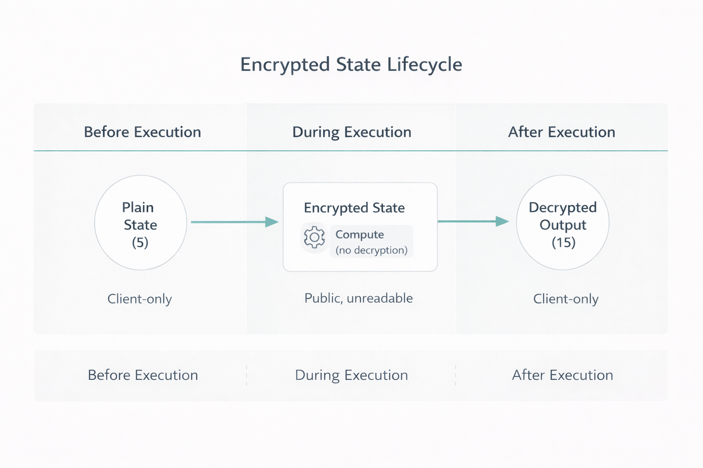
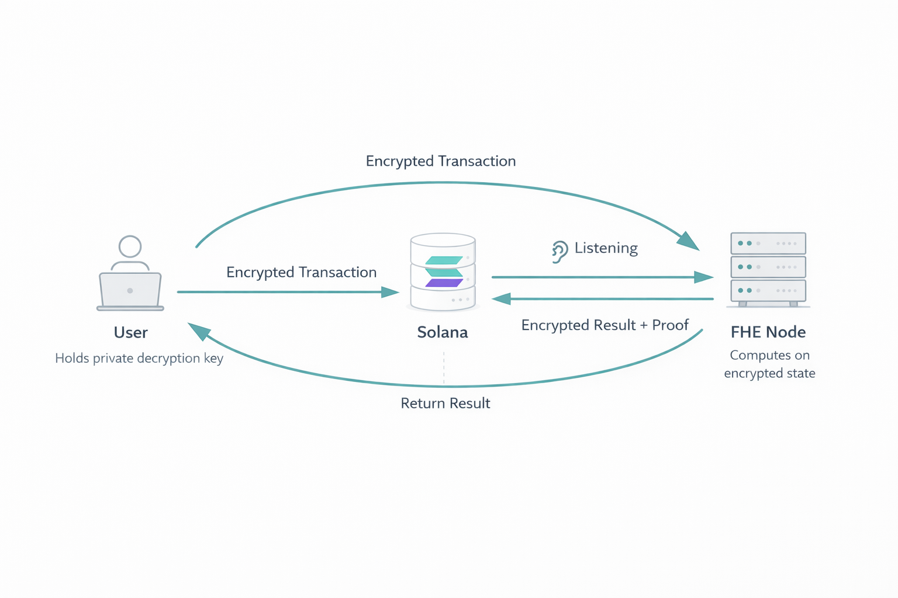
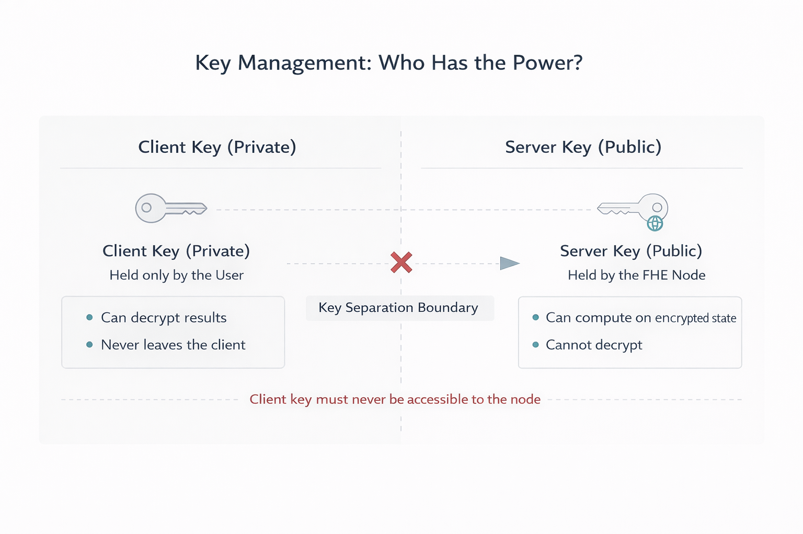

# 🛡️ FHESTATE

### *CONFIDENTIAL COMPUTING ON SOLANA*

> **"Data should be seen by its owner, not by the node."**

[](https://github.com/fhestate/fhestate-rs)
[](https://solana.com)
[](https://github.com/zama-ai/tfhe-rs)
[](LICENSE)

[**Quick Start**](docs/QUICKSTART.md) • [**Documentation**](https://docs.fhestate.org) • [**API Reference**](docs/API.md) • [**Examples**](docs/EXAMPLES.md) • [**Buy FHESTATE**](https://pump.fun/coin/4cfEdG5Z814n3SvJYBDvvHg3VVFmRDgVqKUdaganpump)

---

## 🌟 Overview

**FHESTATE** is a practical implementation of Fully Homomorphic Encryption (FHE) integrated with the Solana blockchain. It enables **private computation with public verification** — allowing you to perform operations on encrypted data while posting cryptographic proofs on-chain for transparency and auditability.

### What Makes FHESTATE Unique?

- 🔒 **True Privacy**: Compute on encrypted data using TFHE-rs (Zama). The node never sees plaintext.
- 📂 **Persistent State PDAs**: Encrypted user state persists on-chain via Program Derived Addresses, keyed to each submitter.
- 🚀 **Dual Ingestion Paths**: Submit tasks via off-chain cache URI (standard) or embed small ciphertexts directly in the transaction (inline fast-path).
- ⛓️ **Deterministic Transition Engine**: Every state update is SHA256 hash-chained — rollbacks and unauthorized transitions are rejected on-chain.
- 📊 **Verifiable Commitments**: Every computation produces a SHA256 proof hash posted back to the blockchain.

---

## 🔮 The Concept: Public Verification, Private Data

FHESTATE enables **Trustless Confidential Computing**.

Unlike Zero-Knowledge Proofs (which prove a statement *about* data without revealing it), **Fully Homomorphic Encryption** allows the server to actually *compute on* the data without ever seeing it in plaintext.

### High-Level Overview



---

## 🎯 Use Cases

- **Private Voting**: Tally encrypted ballots homomorphically without revealing individual votes
- **Sealed-Bid Auctions**: Determine the winner without exposing any bid amounts
- **Confidential Trading**: Execute operations on encrypted order books
- **Privacy-Preserving Analytics**: Compute statistics on encrypted datasets
- **Secure Multi-Party Computation**: Collaborative computation without revealing individual inputs

---

## 🏗️ Architecture

### System Architecture



### Technical Workflow

The FHESTATE protocol implements a **Trustless Confidential Computing** cycle:

1. **Client-Side Encryption**: Inputs are encrypted locally using TFHE-rs. The private key *never* leaves the client.
2. **Provenance Commitment**: A SHA256 hash of the ciphertext is posted to Solana, anchoring the data to a specific block time.
3. **Encrypted Execution**: `fhe-node` polls the chain, retrieves the encrypted payload from cache, and performs homomorphic operations *blindly* on the ciphertexts using the server key.
4. **State Chaining**: The node computes a new SHA256 proof hash and calls `update_state` or `update_state_pda` on-chain. The Coordinator program enforces `previous_state_hash == current_state_hash` before accepting the update.
5. **Owner Decryption**: Only the original user (holder of `client_key.bin`) can decrypt the result.

### Key Management



| Key | Visibility | Held By | Purpose |
|-----|-----------|---------|---------|
| `client_key.bin` | 🔴 SECRET | User only | Encrypt inputs, decrypt results |
| `server_key.bin` | 🟢 Public | Node | Perform homomorphic math on ciphertexts |

**Learn more:** [Architecture Documentation](docs/ARCHITECTURE.md)

---

## 🛠️ Technical Implementation

### 1. Persistent State PDAs

Every user's encrypted state is stored in a Program Derived Address (PDA) with seeds `[b"state", owner_pubkey]`. The PDA is deterministic — given any wallet address, anyone can compute its state account address without an on-chain lookup:

```rust
// programs/coordinator/src/lib.rs
#[account]
pub struct StateContainer {
    pub owner: Pubkey,
    pub state_hash: [u8; 32], // SHA256 of current ciphertext bytes
    pub state_uri: String,    // Off-chain URI: "local://<hash>" or "ipfs://<cid>"
    pub version: u64,         // Monotonically incrementing — incremented on every update
}
```

The `state_hash` field starts as all-zeros (uninitialized). Once the first FHE computation is posted, it becomes the SHA256 of the result ciphertext bytes, and every subsequent update must supply the current `state_hash` as `previous_state_hash` — creating an unbreakable hash chain.

### 2. Deterministic State Chaining

Every update must supply the `previous_state_hash`. The Coordinator program enforces this on-chain:

```rust
require!(
    state_container.state_hash == previous_state_hash,
    CoordinatorError::StateHashMismatch
);
```

This makes state rollbacks and replay attacks impossible.

### 3. Dual Ciphertext Ingestion

**Standard Path** — for any value size:
```bash
cargo run --bin fhe-cli -- submit --op 0 --value 42
```
The CLI encrypts the value into a `FheUint32` ciphertext (~32 KB), serializes it with `bincode`, stores it in the local content-addressed cache (`.fhe_cache/<sha256>.bin`), and posts the `local://<sha256>` URI to Solana via the Coordinator program's `submit_task` instruction. The `fhe-node` polls for new `Task` accounts, resolves the URI from cache, and runs the homomorphic operation.

**Inline Fast-Path** — for small inputs (note: Solana transactions are capped at 1232 bytes total):
```bash
cargo run --bin fhe-cli -- submit-input --op 0 --value 42
```
The CLI encrypts the value, caches it locally by SHA256 hash, and embeds the ciphertext bytes directly in the `submit_input` instruction data. Because `FheUint32` ciphertexts are ~32 KB, this path will exceed Solana's transaction size limit for standard integer types — it is designed for future support of smaller FHE types (e.g. `FheBool`). The node detects the `StateContainer` version bump, fetches the transaction from chain to extract the op code, and resolves the ciphertext from local cache via the `inline://<hash>` URI stored in the PDA.

---

## 🚀 Quick Start

### Prerequisites

- **Rust**: 1.70 or higher
- **Solana CLI**: 1.18 or higher

### Installation

```bash
git clone https://github.com/fhestate/fhestate-rs.git
cd fhestate-rs
cargo build --release
```

### 1. Generate FHE Keys

```bash
# Run in release mode — key generation takes 30-60s
cargo run --release --bin fhe_proof -- keygen
```

Output:
- `fhe_keys/client_key.bin` — Your **secret** key. Never share this.
- `fhe_keys/server_key.bin` — The **public** server key used by the node (~100 MB).

### 2. Run the Local Demo

```bash
cargo run --release --bin fhe_proof -- demo
```

Encrypts the string `"Solana Privacy Ops"` byte-by-byte using `FheUint8`, performs a homomorphic `+1` shift on each encrypted character, then decrypts and verifies the result.

### 3. Setup On-Chain State

```bash
# Configure wallet
solana-keygen new --outfile deploy-wallet.json --no-bip39-passphrase
solana airdrop 2 -k deploy-wallet.json

# Initialize your StateContainer PDA
cargo run --bin fhe-cli -- setup
```

### 4. Submit a Private Computation

```bash
# Standard path (works for any value)
cargo run --release --bin fhe-cli -- submit --op 0 --value 42

# Inline fast-path (embeds ciphertext in transaction)
cargo run --release --bin fhe-cli -- submit-input --op 0 --value 42
```

### 5. Start the Executor Node

```bash
cargo run --release --bin fhe-node -- --program-id <YOUR_PROGRAM_ID>
```

---

## 🔧 Program Deployment Options

### Option 1: Use Default Program (Recommended for Quick Start) ✅

The SDK defaults to the SPL Memo program (`MemoSq4gqABAXKb96qnH8TysNcWxMyWCqXgDLGmfcHr`) for demo purposes. No deployment needed.

### Option 2: Deploy Your Own Coordinator Program 🔒

```bash
cd programs/coordinator
cargo build-bpf

solana program deploy target/deploy/coordinator.so
# Note the Program ID from output

cargo run --bin fhe-cli -- submit \
    --program <YOUR_PROGRAM_ID> \
    --op 0 --value 42
```

The Coordinator program provides the full protocol: `initialize`, `register_executor`, `submit_task`, `initialize_state`, `submit_input`, `update_state`, `update_state_pda`, `request_reveal`, `provide_reveal`, and `challenge_task`.

---

## 📦 Components

### `fhe_proof` — Local Verification Tool

```bash
cargo run --release --bin fhe_proof -- keygen    # Generate keys
cargo run --release --bin fhe_proof -- demo      # Run local FHE demo
```

### `fhe-cli` — Command Line Interface

```bash
cargo run --bin fhe-cli -- setup                          # One-time setup
cargo run --bin fhe-cli -- init-state                     # Initialize StateContainer PDA
cargo run --bin fhe-cli -- submit --op 0 --value 42       # Submit standard task
cargo run --bin fhe-cli -- submit-input --op 0 --value 42 # Submit inline input
cargo run --bin fhe-cli -- reveal --task <TASK_PUBKEY>    # Request result reveal
```

**Operation codes:**

| Code | Operation | Notes |
|------|-----------|-------|
| `0` | ADD | Homomorphic addition — fast (~100ms) |
| `1` | SUB | Homomorphic subtraction |
| `2` | MUL | Homomorphic multiplication — expensive (~800ms+, requires relinearization) |
| `3` | CMP | Returns encrypted `1` if `a < b`, else encrypted `0` |
| `4` | AND | Bitwise AND |
| `5` | OR  | Bitwise OR |
| `6` | XOR | Bitwise XOR |

### `fhe-node` — Background Executor

```bash
cargo run --release --bin fhe-node \
    --rpc-url https://api.devnet.solana.com \
    --program-id <PROGRAM_ID> \
    --wallet deploy-wallet.json \
    --server-key fhe_keys/server_key.bin
```

Polls Solana every `2 seconds` (configurable via `POLL_INTERVAL_SECS`) for new `Task` accounts and `StateContainer` version bumps. For each pending task it:
1. Resolves the input ciphertext from local cache (via `local://`, `ipfs://`, or `inline://` URI)
2. Loads the current state ciphertext from the submitter's `StateContainer` PDA
3. Applies the FHE operation using `StateTransition::apply()` — which runs `FheMath::execute_op()` on the encrypted data using the loaded `ServerKey`
4. Serializes and stores the new state ciphertext in `.fhe_cache/`
5. Posts the new `state_hash` and `state_uri` back to the chain via `update_state` or `update_state_pda`

The node holds **only** `server_key.bin` — it performs all computation blindly and never has access to `client_key.bin`.

---

## 🎓 SDK Usage

```rust
use fhestate_rs::{KeyManager, FheMath, activate_server_key};

// 1. Load keys
let keys = KeyManager::load("./fhe_keys")?;
activate_server_key(&keys.server_key);

// 2. Encrypt inputs
let a = FheMath::encrypt_u32(100, &keys.client_key);
let b = FheMath::encrypt_u32(200, &keys.client_key);

// 3. Compute homomorphically (no decryption occurs)
let sum = FheMath::add(&a, &b);

// 4. Decrypt locally
let result = FheMath::decrypt_u32(&sum, &keys.client_key);
assert_eq!(result, 300);
```

**Supported operations on `FheUint32`:** `add`, `sub`, `mul`, `bitand`, `bitor`, `bitxor`, `cmp`, `add_scalar`, `sub_scalar`, `mul_scalar`

**Supported types:** `FheUint8`, `FheUint32`, `FheUint64`

> `FheUint8` is used for the demo (byte-level string operations). `FheUint32` is the primary type for state computation — all `FheMath` operations operate on `FheUint32`. `FheUint64` is available for encryption/decryption but has higher latency.

---

## 🌐 Verified Transactions

Real FHE transactions on Solana Devnet:

| Date | Operation | Transaction Hash | Status |
|------|-----------|------------------|--------|
| 2026-01-28 | FHE Task Submission | [`4w9MESyqbMTkvNZAVn1uLBz1tD8onSuwEqh4yjaxrZLaUvKM7Wf63etQcjvC6XMuRso7auGpH6chFQC6YGyAJ41f`](https://explorer.solana.com/tx/4w9MESyqbMTkvNZAVn1uLBz1tD8onSuwEqh4yjaxrZLaUvKM7Wf63etQcjvC6XMuRso7auGpH6chFQC6YGyAJ41f?cluster=devnet) | ✅ Confirmed |
| 2026-01-28 | Inline Input Submission | [`454d1RTd6vbriUF46JLbomNZuX65aRMxuLDGmqWAq7oDUgFqaAtspsRdTj9yz6ofbwAA7uKrnuDxDKhE7Nw4X2v4`](https://explorer.solana.com/tx/454d1RTd6vbriUF46JLbomNZuX65aRMxuLDGmqWAq7oDUgFqaAtspsRdTj9yz6ofbwAA7uKrnuDxDKhE7Nw4X2v4?cluster=devnet) | ✅ Confirmed |

---

## 📊 Performance

| Operation | Time (avg) | Notes |
|-----------|-----------|-------|
| Key Generation | ~30-60s | One-time setup, CPU intensive |
| Encrypt `FheUint8` | ~50ms | Client-side |
| Encrypt `FheUint32` | ~50ms | Client-side, ~32 KB ciphertext |
| Homomorphic ADD | ~100ms | Server-side on encrypted data |
| Homomorphic MUL | ~800ms+ | Requires relinearization |
| Blockchain Submission | ~5-13s | Network dependent |

> FHE operations are computationally intensive by design. This is the fundamental tradeoff for achieving mathematically provable privacy.

---

## 🏰 Security Model

- **Privacy by Design**: Data remains encrypted during transit, storage, and *computation*. The `fhe-node` only holds `server_key.bin` — it operates blindly on ciphertexts it cannot read.
- **Trust Minimization**: Even if the node is compromised, the attacker sees only random-looking lattice noise. Without `client_key.bin`, decryption is computationally infeasible.
- **Auditable History**: Every state transition leaves an immutable, hash-chained trace on Solana. The `version` counter is monotonically increasing and the `state_hash` chain cannot be forged or rolled back.
- **Replay Attack Prevention**: Each `update_state` call requires `previous_state_hash == state_container.state_hash`. Any replayed or out-of-order transaction will fail with `StateHashMismatch`.
- **128-bit Security**: TFHE-rs uses lattice-based cryptography (Learning With Errors) with 128-bit quantum-resistant parameters. IND-CPA secure by construction.
- **Staking & Slashing**: Executors must stake SOL via `register_executor`. If a fraudulent result is submitted, the original submitter can call `challenge_task` which slashes the executor's stake to zero and transfers it to the challenger.

> [!NOTE]
> FHESTATE is currently in **Devnet Beta**. The FHE cryptography (TFHE-rs v0.7.3) is production-grade. The coordination layer is in active development and should not be used for high-value Mainnet deployments without a security review.

---

## 📚 Documentation

| Document | Description |
|----------|-------------|
| [Quick Start Guide](docs/QUICKSTART.md) | Get running in 5 minutes |
| [Architecture Overview](docs/ARCHITECTURE.md) | Deep dive into system design |
| [API Reference](docs/API.md) | Complete SDK and CLI reference |
| [Examples](docs/EXAMPLES.md) | Code examples for common use cases |
| [FAQ](docs/FAQ.md) | Technical questions answered |
| [Contributing](docs/CONTRIBUTING.md) | How to contribute |

---

## 📜 License

MIT License — see [LICENSE](LICENSE) for details.

---

## 🙏 Acknowledgments

- **Zama**: For the [TFHE-rs](https://github.com/zama-ai/tfhe-rs) library
- **Solana**: For high-performance blockchain infrastructure
- **Rust Community**: For exceptional tooling and ecosystem

---

## 📞 Contact & Support
- **Documentation**: [Comprehensive Technical Specs](https://docs.fhestate.org)
- **GitHub Issues**: [Report bugs or request features](https://github.com/fhestate/fhestate-rs/issues)
- **Discussions**: [Join community discussions](https://github.com/fhestate/fhestate-rs/discussions)
- **Twitter**: [@fhe_state](https://twitter.com/fhe_state)

---

<div align="center">
Copyright © 2026 FHESTATE Protocol. All rights reserved.
</div>
