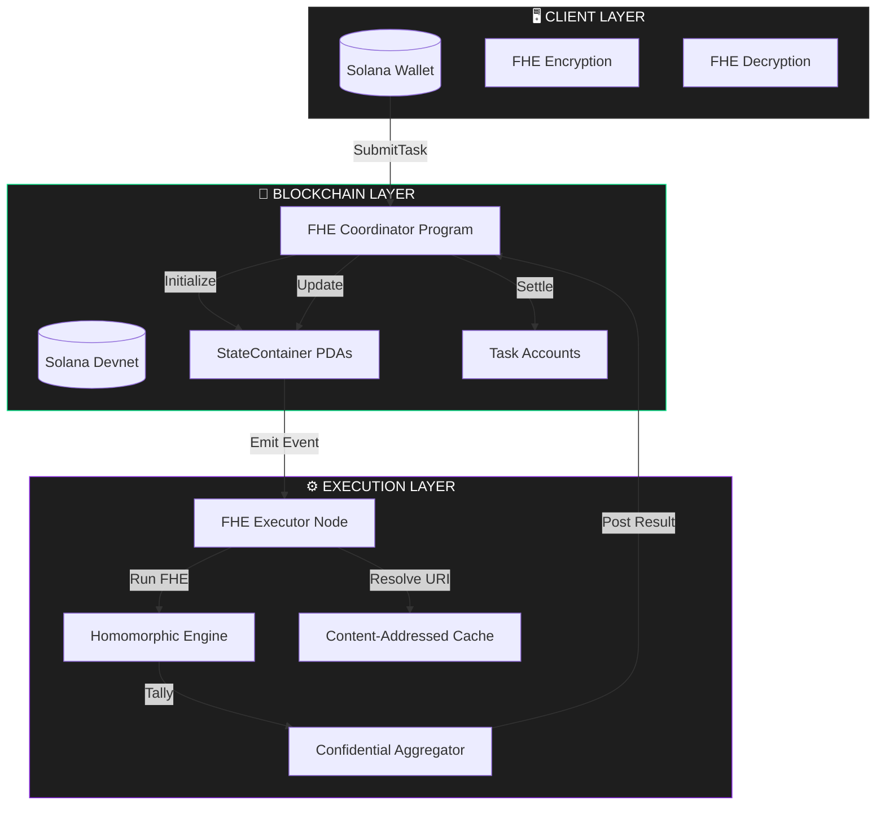

# FHESTATE Architecture

**Technical blueprint for privacy-preserving computation on Solana.**

[](https://github.com/fhestate/fhestate-rs)

---

## Design Navigator

*   **1. System Overview**
    *   [High-Level Diagram](#high-level-architecture)
    *   [Hybrid Model](#system-overview)
*   **2. Core Components**
    *   [FHE Engine](#1-fhe-engine-tfhe-rs)
    *   [Client & Node](#2-fhe-cli-client)
*   **3. Mechanics**
    *   [Data Flow](#data-flow)
    *   [Cryptographic Design](#cryptographic-design)
*   **4. Security & Performance**
    *   [Security Model](#security-model)
    *   [Benchmarks](#performance-considerations)

---

## System Overview

FHEstate implements a **Hybrid Privacy Architecture** that combines the best of two worlds:
1.  **Off-chain FHE computation** (for absolute data privacy).
2.  **On-chain Solana verification** (for immutable audit trails and transparency).

### High-Level Architecture


```mermaid
flowchart TB
    subgraph Client ["🖥️ CLIENT LAYER"]
        direction TB
        Wallet[("Solana Wallet")]
        Encrypt["FHE Encryption"]
        Decrypt["FHE Decryption"]
    end

    subgraph Blockchain ["🔗 BLOCKCHAIN LAYER"]
        Solana[("Solana Devnet")]
        Program["FHE Coordinator Program"]
        PDA["StateContainer PDAs"]
        Tasks["Task Accounts"]
    end

    subgraph Execution ["⚙️ EXECUTION LAYER"]
        Node["FHE Executor Node"]
        Compute["Homomorphic Engine"]
        Cache["Content-Addressed Cache"]
        Aggregator["Confidential Aggregator"]
    end

    %% Flows
    Wallet -->|SubmitTask| Program
    Program -->|Initialize| PDA
    PDA -->|Emit Event| Node
    Node -->|Resolve URI| Cache
    Node -->|Run FHE| Compute
    Compute -->|Tally| Aggregator
    
    %% Return Path
    Aggregator -->|Post Result| Program
    Program -->|Update| PDA
    Program -->|Settle| Tasks

    %% Styles
    style Client fill:#1e1e1e,stroke:#333,color:#fff
    style Blockchain fill:#1e1e1e,stroke:#14F195,color:#fff
    style Execution fill:#1e1e1e,stroke:#8A2BE2,color:#fff
```

---

## Core Components

### 1. FHE Engine (TFHE-rs)

**Library**: [Zama TFHE-rs v0.7.3](https://github.com/zama-ai/tfhe-rs)

The mathematical core that allows computation on encrypted data. TFHE (Torus Fully Homomorphic Encryption) operates on the LWE (Learning With Errors) hard problem.

*   **IND-CPA Security**: Mathematically proven indistinguishability under chosen-plaintext attack.
*   **Probabilistic Encryption**: Every call to `encrypt()` produces a different ciphertext. The same plaintext `42` encrypted twice yields completely different bit patterns — defeating pattern-matching attacks.
*   **Noise Budget**: Each FHE operation adds cryptographic noise to the ciphertext. If noise exceeds the bootstrapping threshold, decryption fails. TFHE-rs manages this automatically via bootstrapping during operations.
*   **Types used**: `FheUint8` (for demo/string ops), `FheUint32` (primary computation type), `FheUint64` (available).
*   **Operations**: Arithmetic (`+`, `-`, `*`), Bitwise (`AND`, `OR`, `XOR`), Comparison (`EQ`, `GT`, `LT`, `MAX`, `MIN`), and Optimized Tallying.
*   **Tree-Sum Optimization**: The `FheMath::tree_sum` logic enables $O(\log n)$ noise growth for large aggregations, critical for confidential governance scaling.
*   **Server Key Activation**: The `ServerKey` must be set globally on the thread before any homomorphic operation via `set_server_key()` (or `activate_server_key()` in the SDK). This is a TFHE-rs requirement — the key is stored in thread-local storage.
*   **Core Cache Optimization**: Implements a strict LRU (Least Recently Used) eviction policy for ciphertext buffers and refined heap allocations, avoiding memory bloat during high-throughput execution cycles.

### 2. `fhe-cli` (Client)

The bridge between the user and the blockchain.

*   **Role**: Encrypts user inputs and manages decryption keys.
*   **Action**: Interacts with the `coordinator` program to submit tasks or initialize state.
*   **Security**: Holds the `ClientKey` (Secret) locally. **Never leaves the device.**

### 3. `fhe-node` (Executor & Aggregator)

The decentralized worker that processes FHE tasks and aggregates multi-party results.

*   **Role**: Listens to `coordinator` events and polls for `Pending` tasks.
*   **Confidential Aggregator**: Specializes in the **Dark DAO** protocol, using homomorphic branch logic to tally votes and detect winners without revealing individual scores or margins.
*   **Action**: Performs "Blind Computation" via `StateTransition::apply()`.
*   **Security**: Only holds the `ServerKey` (Public). **Cannot see plaintext.**

---

## Data Flow

### End-to-End Transaction Lifecycle

1.  **Preparation**: User encrypts input via `fhe-cli` → `FheUint32::encrypt(value, &client_key)` → serialized with `bincode` → ~32 KB ciphertext bytes.
2.  **Caching**: CLI stores ciphertext in `.fhe_cache/<sha256>.bin` via `LocalCache::store()`. URI = `local://<sha256_hex>`.
3.  **Dispatch**: `fhe-cli` sends a `submit_task` (standard) or `submit_input` (inline) instruction to the Coordinator. The instruction carries the `input_hash` (SHA256 of ciphertext), the `state_uri`, and the `operation` code.
4.  **Detection**: `fhe-node` polls every 2s. For standard tasks: detects new `Task` account with `Pending` status. For inline: detects `StateContainer.version` increment, then fetches the transaction from chain and parses the `submit_input` instruction data to extract the op code.
5.  **State Resolution**: Node calls `get_account_data(&state_pda)` to fetch the current `StateContainer`. Reads `state_uri` (offset `76`) and `state_hash` (offset `40..72`) from the raw account data.
6.  **Computation**: `StateTransition::apply(&cache, old_state_uri, input_bytes, op)` → loads old state ciphertext from cache → runs `FheMath::execute_op(op, &old_ct, &input_ct)` → serializes result → stores to `.fhe_cache/` → returns `(new_uri, sha256_hash)`.
7.  **Settlement**: Node calls `update_state` or `update_state_pda` on-chain, supplying `previous_state_hash`, `result_hash`, and `result_uri`. The Coordinator enforces `state_container.state_hash == previous_state_hash` before accepting.
8.  **Verification**: User fetches the result ciphertext from `.fhe_cache/` using the `state_uri` from the `StateContainer` PDA, verifies the on-chain hash matches `SHA256(ciphertext_bytes)`, and decrypts locally with `client_key.bin`.

---

## Staking & Coordinator Mechanics

FHEstate uses a **Staked-Executor Model** coupled with a strict **Coordinator** program to ensure protocol integrity:

*   **Registration**: Executors call `register_executor` with a SOL stake amount ≥ `registry.min_stake`. The SOL is transferred via CPI to the `Executor` account and locked there.
*   **Multi-Node Coordination & CPI Enforcement**: The Coordinator establishes and maintains the multi-node coordination state. To secure enclave registration, the Coordinator program enforces strict BPF cross-program invocation (CPI) constraints and instructions sysvar introspection to authenticate TEE node attestation credentials.
*   **Attribution**: Each `update_state` call sets `task.executor = executor.owner`, creating an immutable on-chain record of who processed each task.
*   **Slashing**: If an executor provides a fraudulent result or reveal, the original submitter (and only the submitter) can call `challenge_task`. This is enforced on-chain: `require!(task.submitter == challenger.key())`.
*   **Resolution**: Successful challenge immediately transfers `executor.stake` lamports to the challenger via direct lamport manipulation, sets `executor.stake = 0`, `executor.active = false`, and marks the task as `Challenged`.
*   **V1 Limitation**: Challenge resolution is optimistic — the submitter's claim is trusted. Future versions will implement ZK proof arbitration where the node must prove it applied the correct FHE operation.

---

## 🛡️ Dark DAO: Confidential Governance

FHESTATE provides a specialized architecture for **Confidential Governance (Dark DAO)**, where proposal voting and tallying are performed homomorphically.

### 🌳 Tree-Sum Aggregator
To scale to thousands of participants, FHESTATE uses a **Binary Tree Aggregator** instead of linear summation:
- **Efficiency**: Reduces noise growth from $O(n)$ to $O(\log n)$.
- **Stability**: Ensures the final tally remains decryptable even after 1000+ operations.

### 🕵️ Private Winner & Commitment Verification
- **Pedersen Commitment Verifiers**: Integrates Pedersen commitment verifiers to validate vote commitments on-chain without revealing the voter's identity or ballot choice. This supports anonymous, untraceable proposals.
- **Winner Detection**: Using homomorphic comparison gates (`MAX` / `EQ`), the aggregator determines the winning choice locally:
  - Only the **Winner ID** or **Final Outcome** is revealed.
  - **Individual votes** and **margins between candidates** remain cryptographically hidden forever.

---

## 🔒 Shielded Vault: Private Asset Pools

FHESTATE implements a **Shielded Vault program** (`programs/shielded_vault`) that enables users to deposit, transfer, and withdraw assets completely confidentially using Fully Homomorphic Encryption.

### 🛡️ Core Program Primitives
*   **VaultRegistry**: A global config account tracking the designated admin, the trusted `attestation_authority` public key, the `total_liquidity` of shielded funds, and the `approved_mrenclave` 32-byte code measurement hash.
*   **EncryptedAccount PDA**: An individual user account mapped deterministically via seeds `[b"enc_account", owner_pubkey]`. Instead of storing plaintext balances, it stores `balance_hash` (the SHA256 commitment of their encrypted `FheUint32` balance ciphertext).
*   **EnclaveAccount PDA**: Represents a verified TEE enclave authorised to submit FHE state transitions and unshield funds. Mapped via seeds `[b"enclave", enclave_pubkey]`.

### 🔒 Intel SGX / TEE Remote Attestation
*   **Instructions Sysvar Introspection**: To register an enclave, the admin submits an Ed25519 signature verification precompile instruction immediately preceding the `register_enclave` instruction. The program introspects the sysvar instructions account, verifying the signature.
*   **64-Byte Attestation Verification Payload**: The signed message must be a 64-byte payload format `[enclave_pubkey (32 bytes) | mrenclave (32 bytes)]`. The program checks that the signer matches the registered `attestation_authority`, the signed enclave key matches target parameters, and the signed measurement (`MRENCLAVE`) matches the `approved_mrenclave` stored in the registry.

### 🔄 Shielding & Unshielding Workflows
1.  **Shielding (Deposit)**: The user transfers SOL into the vault using the `shield_funds` instruction. The program locks the SOL and emits a `ShieldEvent(user, amount)`. The off-chain FHE executor node listens to this event, adds the deposited amount homomorphically to the user's encrypted balance, and updates the user's `balance_hash` on-chain.
2.  **Confidential Transfers (TEE Authorized)**: To send funds privately, the authorized TEE enclave processes the blinded math off-chain using the public `ServerKey` and updates `sender_account.balance_hash` and `receiver_account.balance_hash` on-chain via `execute_transfer_fhe_tee`.
3.  **Unshielding (Withdrawal - TEE Authorized)**: Withdrawal requests (`unshield_funds_tee`) are routed through and signed by an active enclave. The enclave decrypts the user's balance locally (via their `ClientKey` inside TEE secure memory) to verify there are sufficient funds before submitting the withdrawal transaction on-chain.

---

## Cryptographic Design

### 🔑 Key Management

| Key Type | Visibility | Purpose | Size |
| :--- | :--- | :--- | :--- |
| **Client Key** | 🔴 **SECRET** | Encrypt/Decrypt data. Owned by User. | ~10 MB |
| **Server Key** | 🟢 **PUBLIC** | Perform Homomorphic Math. Owned by Node. | ~100 MB |

### 🛡️ Encryption Specs

*   **Scheme**: TFHE (Torus Fully Homomorphic Encryption)
*   **Security**: 128-bit quantum-secure (lattice-based).
*   **Expansion**: 1 byte plaintext ≈ 4 KB ciphertext (~4000x expansion).

### 🗄️ Content-Addressed Cache

FHESTATE uses a local file-based, content-addressed storage system (`LocalCache`) for ciphertexts:

*   **Address = Content**: Ciphertext files are named by their SHA256 hash — `<sha256_hex>.bin`. The same ciphertext always maps to the same filename. Corruption is detectable by recomputing the hash.
*   **URI Scheme**: `local://<64-char-sha256-hex>` for local files, `ipfs://<cid>` for IPFS (simulated in v0.1.0).
*   **Full hash**: URIs encode the full 32-byte (64-char hex) SHA256 — no truncation — to minimize collision risk.
*   **On-chain anchor**: Only the URI string and SHA256 hash are stored in the `StateContainer` PDA on-chain. The actual ciphertext (32 KB+) lives in the local cache, keeping transaction costs minimal.

We use **SHA256** hashes of the ciphertext to create a verifiable link between the on-chain event and the off-chain data.

```rust
// Cryptographic Link
Proof = SHA256( Serialize( Encrypted_Data ) )
```

*   **Deterministic**: Same encrypted input always yields same hash.
*   **Verifiable**: Anyone with the ciphertext can verify it matches the on-chain hash.

---

## Security Model

### Threat Analysis

| Threat | Status | Mitigation |
| :--- | :--- | :--- |
| **Data Leakage** | ✅ **Solved** | Data is always encrypted (FHE). Node sees only lattice noise — mathematically indistinguishable from random. |
| **Tampering** | ✅ **Solved** | Solana provides immutable timestamp, ordering, and signature verification. |
| **Fake Results** | ✅ **Solved** | SHA256 hash chain: `state_hash` on-chain must match `SHA256(result_ciphertext_bytes)`. User can verify locally before decrypting. |
| **Replay Attacks** | ✅ **Solved** | `previous_state_hash` must match current on-chain hash. Solana blockhash expiry (5 min) prevents stale transaction replay. |
| **State Rollback** | ✅ **Solved** | `StateContainer.version` is monotonically increasing. Hash chain means you cannot revert to an earlier state without breaking the chain. |
| **Key Theft (Server)** | ✅ **By Design** | Server key is public — possessing it only lets you run FHE ops, not decrypt anything. |
| **Key Theft (Client)** | ⚠️ **User Risk** | Users must protect `client_key.bin`. Loss of this key means permanent data loss. No recovery mechanism exists. |
| **Malicious Node** | 🛡️ **Mitigated** | Node can submit wrong results but staking/slashing disincentivizes this. Future ZK-verification is planned. |

---

## Performance Considerations

Benchmarks run on standard consumer hardware (M1/M2 Class).

### FHE Operations (Time per Ops)

| Operation | Time (ms) | Notes |
| :--- | :--- | :--- |
| **Encrypt `u8`** | `52ms` | Fast enough for interactive CLI |
| **Decrypt `u8`** | `48ms` | Instant for user |
| **Add `u32 + u32`** | `112ms` | Homomorphic Addition |
| **Mul `u32 * u32`** | `850ms` | Homomorphic Multiplication |
| **Tree-Sum (8-way)** | `3200ms` | **Optimized Binary Tallying** |
| **Winner (3-way)** | `1200ms` | **Confidential Winner Detection** |

### Blockchain Latency

*   **Solana Block Time**: ~400ms
*   **Confirmation**: ~1-2 seconds (Finalized)
*   **Total Round Trip**: ~5-10 seconds (Network dependent)

---