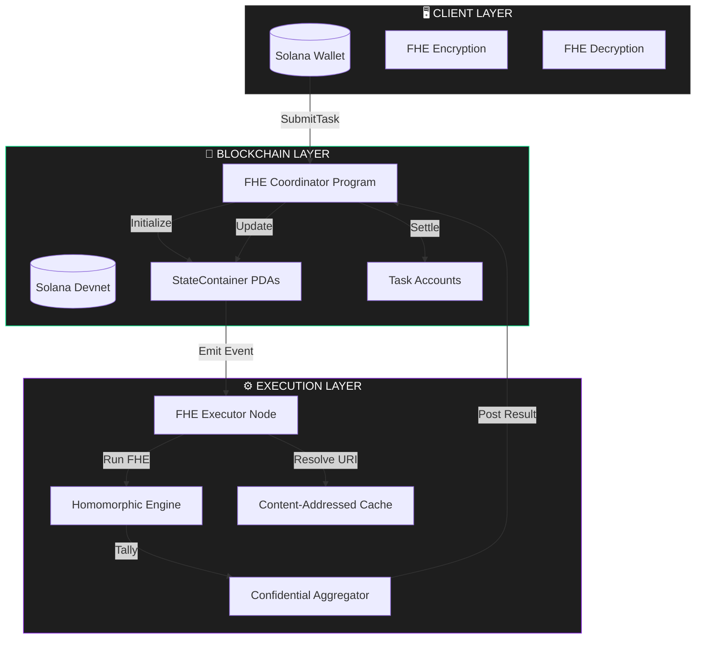

# FHESTATE Architecture

**Technical blueprint for privacy-preserving computation on Solana.**

[](https://github.com/fhestate/fhestate-rs)

---

## Design Navigator

*   **1. System Overview**
    *   [High-Level Diagram](#high-level-architecture)
    *   [Hybrid Model](#system-overview)
*   **2. Core Components**
    *   [FHE Engine](#1-fhe-engine-tfhe-rs)
    *   [Client & Node](#2-fhe-cli-client)
*   **3. Mechanics**
    *   [Data Flow](#data-flow)
    *   [Cryptographic Design](#cryptographic-design)
*   **4. On-chain Programs**
    *   [Deployed Programs](#deployed-programs-solana-devnet)
    *   [Dark DAO](#dark-dao-confidential-governance)
    *   [Shielded Vault](#shielded-vault-tee-enclave-attestation--confidential-liquidity)
*   **5. Security & Performance**
    *   [Security Model](#security-model)
    *   [Benchmarks](#performance-considerations)

---

## System Overview

FHEstate implements a **Hybrid Privacy Architecture** that combines the best of two worlds:
1.  **Off-chain FHE computation** (for absolute data privacy).
2.  **On-chain Solana verification** (for immutable audit trails and transparency).

### High-Level Architecture


```mermaid
flowchart TB
    subgraph Client ["🖥️ CLIENT LAYER"]
        direction TB
        Wallet[("Solana Wallet")]
        Encrypt["FHE Encryption"]
        Decrypt["FHE Decryption"]
    end

    subgraph Blockchain ["🔗 BLOCKCHAIN LAYER"]
        Solana[("Solana Devnet")]
        Program["FHE Coordinator Program"]
        PDA["StateContainer PDAs"]
        Tasks["Task Accounts"]
    end

    subgraph Execution ["⚙️ EXECUTION LAYER"]
        Node["FHE Executor Node"]
        Compute["Homomorphic Engine"]
        Cache["Content-Addressed Cache"]
        Aggregator["Confidential Aggregator"]
    end

    %% Flows
    Wallet -->|SubmitTask| Program
    Program -->|Initialize| PDA
    PDA -->|Emit Event| Node
    Node -->|Resolve URI| Cache
    Node -->|Run FHE| Compute
    Compute -->|Tally| Aggregator
    
    %% Return Path
    Aggregator -->|Post Result| Program
    Program -->|Update| PDA
    Program -->|Settle| Tasks

    %% Styles
    style Client fill:#1e1e1e,stroke:#333,color:#fff
    style Blockchain fill:#1e1e1e,stroke:#14F195,color:#fff
    style Execution fill:#1e1e1e,stroke:#8A2BE2,color:#fff
```

---

## Core Components

### 1. FHE Engine (TFHE-rs)

**Library**: [Zama TFHE-rs v0.7.3](https://github.com/zama-ai/tfhe-rs)

The mathematical core that allows computation on encrypted data. TFHE (Torus Fully Homomorphic Encryption) operates on the LWE (Learning With Errors) hard problem.

*   **IND-CPA Security**: Mathematically proven indistinguishability under chosen-plaintext attack.
*   **Probabilistic Encryption**: Every call to `encrypt()` produces a different ciphertext. The same plaintext `42` encrypted twice yields completely different bit patterns — defeating pattern-matching attacks.
*   **Noise Budget**: Each FHE operation adds cryptographic noise to the ciphertext. If noise exceeds the bootstrapping threshold, decryption fails. TFHE-rs manages this automatically via bootstrapping during operations.
*   **Types used**: `FheUint8` (for demo/string ops), `FheUint32` (primary computation type), `FheUint64` (available).
*   **Operations**: Arithmetic (`+`, `-`, `*`), Bitwise (`AND`, `OR`, `XOR`), Comparison (`EQ`, `GT`, `LT`, `MAX`, `MIN`), and Optimized Tallying.
*   **Tree-Sum Optimization**: The `FheMath::tree_sum` logic enables $O(\log n)$ noise growth for large aggregations, critical for confidential governance scaling.
*   **Server Key Activation**: The `ServerKey` must be set globally on the thread before any homomorphic operation via `set_server_key()` (or `activate_server_key()` in the SDK). This is a TFHE-rs requirement — the key is stored in thread-local storage.

### 2. `fhe-cli` (Client)

The bridge between the user and the blockchain.

*   **Role**: Encrypts user inputs, runs vault homomorphic helpers (`vault_ops.rs`), and manages decryption keys.
*   **Action**: Interacts with the `coordinator` program to submit tasks or initialize state; emits JSON balance hashes for the Shielded Vault program.
*   **Security**: Holds the `ClientKey` (Secret) locally. **Never leaves the device.**

### 3. `fhe-node` (Executor & Aggregator)

The decentralized worker that processes FHE tasks and aggregates multi-party results.

*   **Role**: Listens to `coordinator` events and polls for `Pending` tasks.
*   **Confidential Aggregator**: Specializes in the **Dark DAO** protocol, using homomorphic branch logic to tally votes and detect winners without revealing individual scores or margins.
*   **Action**: Performs "Blind Computation" via `StateTransition::apply()`.
*   **Security**: Only holds the `ServerKey` (Public). **Cannot see plaintext.**

---

## Data Flow

### End-to-End Transaction Lifecycle

1.  **Preparation**: User encrypts input via `fhe-cli` → `FheUint32::encrypt(value, &client_key)` → serialized with `bincode` → ~32 KB ciphertext bytes.
2.  **Caching**: CLI stores ciphertext in `.fhe_cache/<sha256>.bin` via `LocalCache::store()`. URI = `local://<sha256_hex>`.
3.  **Dispatch**: `fhe-cli` sends a `submit_task` (standard) or `submit_input` (inline) instruction to the Coordinator. The instruction carries the `input_hash` (SHA256 of ciphertext), the `state_uri`, and the `operation` code.
4.  **Detection**: `fhe-node` polls every 2s. For standard tasks: detects new `Task` account with `Pending` status. For inline: detects `StateContainer.version` increment, then fetches the transaction from chain and parses the `submit_input` instruction data to extract the op code.
5.  **State Resolution**: Node calls `get_account_data(&state_pda)` to fetch the current `StateContainer`. Reads `state_uri` (offset `76`) and `state_hash` (offset `40..72`) from the raw account data.
6.  **Computation**: `StateTransition::apply(&cache, old_state_uri, input_bytes, op)` → loads old state ciphertext from cache → runs `FheMath::execute_op(op, &old_ct, &input_ct)` → serializes result → stores to `.fhe_cache/` → returns `(new_uri, sha256_hash)`.
7.  **Settlement**: Node calls `update_state` or `update_state_pda` on-chain, supplying `previous_state_hash`, `result_hash`, and `result_uri`. The Coordinator enforces `state_container.state_hash == previous_state_hash` before accepting.
8.  **Verification**: User fetches the result ciphertext from `.fhe_cache/` using the `state_uri` from the `StateContainer` PDA, verifies the on-chain hash matches `SHA256(ciphertext_bytes)`, and decrypts locally with `client_key.bin`.

---

## Staking & Governance

FHEstate uses a **Staked-Executor Model** to ensure protocol integrity:

*   **Registration**: Executors call `register_executor` with a SOL stake amount ≥ `registry.min_stake`. The SOL is transferred via CPI to the `Executor` account and locked there.
*   **Attribution**: Each `update_state` call sets `task.executor = executor.owner`, creating an immutable on-chain record of who processed each task.
*   **Slashing**: If an executor provides a fraudulent result or reveal, the original submitter (and only the submitter) can call `challenge_task`. This is enforced on-chain: `require!(task.submitter == challenger.key())`.
*   **Resolution**: Successful challenge immediately transfers `executor.stake` lamports to the challenger via direct lamport manipulation, sets `executor.stake = 0`, `executor.active = false`, and marks the task as `Challenged`.
*   **V1 Limitation**: Challenge resolution is optimistic — the submitter's claim is trusted. Future versions will implement ZK proof arbitration where the node must prove it applied the correct FHE operation.

---

## Deployed programs (Solana Devnet)

| Program | ID | Source |
|---------|-----|--------|
| **Coordinator** | `57YPM8JYv8t6wArmZTD14PNo6ES9CYKGRYcZWC4FZEnq` | `programs/coordinator` |
| **Dark DAO** | `Ay5Z1HQrsfnYNhRt48Mujr7k1b91bV7ir4jATYocVp5s` | `programs/dark_dao` |
| **Shielded Vault** | `FuQzZCwPSRSVLT9gCgcft43a4RkapBJmSTC6CmdomeVQ` | `programs/shielded_vault` |

### Coordinator instructions

| Instruction | Purpose |
|-------------|---------|
| `initialize` | Set `min_stake` for executors |
| `register_executor` | Stake SOL and register FHE worker |
| `submit_task` | Post encrypted task with `input_hash`, `input_uri`, `operation` |
| `initialize_state` | Create submitter `StateContainer` PDA |
| `submit_input` | Inline ciphertext fast-path (small payloads) |
| `update_state` / `update_state_pda` | Hash-chained state transition |
| `request_reveal` / `provide_reveal` | Encrypted result reveal flow |
| `challenge_task` | Submitter fraud challenge + executor slashing |

---

## Dark DAO: Confidential Governance

**Program ID:** `Ay5Z1HQrsfnYNhRt48Mujr7k1b91bV7ir4jATYocVp5s`

Standalone governance program for encrypted ballot casting and homomorphic tally accumulation.

| Instruction | Caller | Effect |
|-------------|--------|--------|
| `initialize` | Authority | Create DAO config |
| `authorize_worker` | Authority | Register FHE worker allowed to call `update_tally` |
| `create_proposal` | Creator | Open proposal + initialize `Tally` PDA |
| `cast_encrypted_vote` | Voter | Record encrypted vote bytes; emit `VoteCast` for worker |
| `update_tally` | Authorized worker | Write `state_hash` + `state_uri` to tally PDA |
| `finalize_tally` | Worker | Close voting period; commit result hash |

Off-chain tally math uses `fhe-cli dao-tally-vote` (`ops::VOTE_TALLY` via `StateTransition::apply`).

### Tree-Sum aggregator

To scale to thousands of participants, FHESTATE uses a **binary tree aggregator** instead of linear summation:
- **Efficiency**: Reduces noise growth from $O(n)$ to $O(\log n)$.
- **Stability**: Keeps tallies decryptable after 1000+ homomorphic additions.

### Private winner detection

Using homomorphic comparison gates (`MAX` / `EQ`), the aggregator determines the winning choice locally:
- Only the **winner ID** or **final outcome** is revealed.
- **Individual votes** and **margins** remain encrypted.

---

## Shielded Vault: TEE Enclave Attestation & Confidential Liquidity

**Program ID:** `FuQzZCwPSRSVLT9gCgcft43a4RkapBJmSTC6CmdomeVQ`

Confidential SOL pool where balances are `FheUint32` ciphertext hashes on-chain. SOL sits in the `vault_auth` PDA. Full instruction reference: [SHIELDED-VAULT-PROGRAM.md](./SHIELDED-VAULT-PROGRAM.md).

### PDAs

| PDA | Seeds | Purpose |
|-----|-------|---------|
| `VaultRegistry` | `["vault_registry"]` | Admin, attestation authority, MRENCLAVE, limits, liquidity |
| `Vault` | `["vault_auth"]` | SOL escrow (receives transfers; not Anchor-initialized) |
| `EncryptedAccount` | `["enc_account", owner]` | Per-user `balance_hash` |
| `EnclaveAccount` | `["enclave", enclave_key]` | TEE signer registration + `is_active` |
| `Proposal` | `["proposal", proposal_id_le]` | In-vault governance tally commitments |

### Instructions (complete)

| Instruction | Authorized by | Effect |
|-------------|---------------|--------|
| `initialize_vault` | Admin | Create `VaultRegistry` |
| `initialize_account` | User | Create `EncryptedAccount` |
| `shield_funds` | User | Deposit SOL; `total_liquidity += amount` |
| `unshield_funds` | Admin | Withdraw SOL from vault |
| `execute_transfer_fhe` | Admin | Update sender/receiver `balance_hash` |
| `update_attestation_authority` | Admin | Rotate attestation signer |
| `update_approved_mrenclave` | Admin | Set approved enclave measurement |
| `update_treasury_limit` | Admin | Set `spending_limit_hash` |
| `update_daily_limit` | Admin | Store 256-byte encrypted limit |
| `update_transaction_threshold` | Admin | Public lamport threshold |
| `register_enclave` | Admin + Ed25519 precompile | Create active `EnclaveAccount` |
| `toggle_enclave` | Admin | Enable/disable enclave |
| `shielded_swap_proxy` | Active enclave + user | Swap lamports + update `balance_hash` |
| `execute_transfer_fhe_tee` | Active enclave | TEE-gated transfer hashes |
| `unshield_funds_tee` | Active enclave | TEE-gated withdrawal |
| `execute_multi_transfer_fhe_tee` | Active enclave | Batch hash updates via `remaining_accounts` |
| `initialize_proposal` | Authority | Create in-vault `Proposal` PDA |
| `submit_dao_vote` | Active enclave | Update yes/no tally hashes |
| `close_registry` | Admin | Drain and zero registry account |

### TEE attestation flow

```
ix[n-1]: Ed25519SigVerify — attestation_authority signs [enclave_key | approved_mrenclave]
ix[n]:   register_enclave(enclave_key) — verifies precompile, creates EnclaveAccount
```

Failures map to `VaultError::InvalidEd25519Instruction`, `InvalidAttestationMessage`, `EnclaveKeyMismatch`, or `InvalidMrenclave`.

### Shielded swap flow

1. Off-chain: `fhe-cli vault-swap-hash` computes post-swap `FheUint32` and `new_balance_hash`.
2. On-chain: enclave + user sign `shielded_swap_proxy(amount_in, min_amount_out, new_balance_hash)`.
3. Program transfers `amount_in` to vault, writes hash, emits `SwapEvent`.

### `fhe-cli` vault helpers

`vault-transfer-hashes`, `vault-deposit-hash`, `vault-swap-hash`, `dao-tally-vote`, `store-ciphertext`, `decrypt-u32`, `check-spending` — see [CLI.md](./CLI.md).

### Integration binaries

`devnet_vault_flow`, `devnet_vault_flow_tee`, `devnet_vault_enclave_flow`, `confidential_governance_flow`, `close_registry` — all target `FuQzZCwPSRSVLT9gCgcft43a4RkapBJmSTC6CmdomeVQ`.

### TypeScript SDK

Instruction builders live in `fhestate-sdk` (`src/solana/programs/vault.ts`).

---

## Cryptographic Design

### 🔑 Key Management

| Key Type | Visibility | Purpose | Size |
| :--- | :--- | :--- | :--- |
| **Client Key** | 🔴 **SECRET** | Encrypt/Decrypt data. Owned by User. | ~10 MB |
| **Server Key** | 🟢 **PUBLIC** | Perform Homomorphic Math. Owned by Node. | ~100 MB |

### 🛡️ Encryption Specs

*   **Scheme**: TFHE (Torus Fully Homomorphic Encryption)
*   **Security**: 128-bit quantum-secure (lattice-based).
*   **Expansion**: 1 byte plaintext ≈ 4 KB ciphertext (~4000x expansion).

### 🗄️ Content-Addressed Cache

FHESTATE uses a local file-based, content-addressed storage system (`LocalCache`) for ciphertexts:

*   **Address = Content**: Ciphertext files are named by their SHA256 hash — `<sha256_hex>.bin`. The same ciphertext always maps to the same filename. Corruption is detectable by recomputing the hash.
*   **URI Scheme**: `local://<64-char-sha256-hex>` for local files, `ipfs://<cid>` for IPFS (simulated in v0.1.0).
*   **Full hash**: URIs encode the full 32-byte (64-char hex) SHA256 — no truncation — to minimize collision risk.
*   **On-chain anchor**: Only the URI string and SHA256 hash are stored in the `StateContainer` PDA on-chain. The actual ciphertext (32 KB+) lives in the local cache, keeping transaction costs minimal.

We use **SHA256** hashes of the ciphertext to create a verifiable link between the on-chain event and the off-chain data.

```rust
// Cryptographic Link
Proof = SHA256( Serialize( Encrypted_Data ) )
```

*   **Deterministic**: Same encrypted input always yields same hash.
*   **Verifiable**: Anyone with the ciphertext can verify it matches the on-chain hash.

---

## Security Model

### Threat Analysis

| Threat | Status | Mitigation |
| :--- | :--- | :--- |
| **Data Leakage** | ✅ **Solved** | Data is always encrypted (FHE). Node sees only lattice noise — mathematically indistinguishable from random. |
| **Tampering** | ✅ **Solved** | Solana provides immutable timestamp, ordering, and signature verification. |
| **Fake Results** | ✅ **Solved** | SHA256 hash chain: `state_hash` on-chain must match `SHA256(result_ciphertext_bytes)`. User can verify locally before decrypting. |
| **Replay Attacks** | ✅ **Solved** | `previous_state_hash` must match current on-chain hash. Solana blockhash expiry (5 min) prevents stale transaction replay. |
| **State Rollback** | ✅ **Solved** | `StateContainer.version` is monotonically increasing. Hash chain means you cannot revert to an earlier state without breaking the chain. |
| **Key Theft (Server)** | ✅ **By Design** | Server key is public — possessing it only lets you run FHE ops, not decrypt anything. |
| **Key Theft (Client)** | ⚠️ **User Risk** | Users must protect `client_key.bin`. Loss of this key means permanent data loss. No recovery mechanism exists. |
| **Malicious Node** | 🛡️ **Mitigated** | Node can submit wrong results but staking/slashing disincentivizes this. Future ZK-verification is planned. |

---

## Performance Considerations

Benchmarks run on standard consumer hardware (M1/M2 Class).

### FHE Operations (Time per Ops)

| Operation | Time (ms) | Notes |
| :--- | :--- | :--- |
| **Encrypt `u8`** | `52ms` | Fast enough for interactive CLI |
| **Decrypt `u8`** | `48ms` | Instant for user |
| **Add `u32 + u32`** | `112ms` | Homomorphic Addition |
| **Mul `u32 * u32`** | `850ms` | Homomorphic Multiplication |
| **Tree-Sum (8-way)** | `3200ms` | **Optimized Binary Tallying** |
| **Winner (3-way)** | `1200ms` | **Confidential Winner Detection** |

### Blockchain Latency

*   **Solana Block Time**: ~400ms
*   **Confirmation**: ~1-2 seconds (Finalized)
*   **Total Round Trip**: ~5-10 seconds (Network dependent)

---