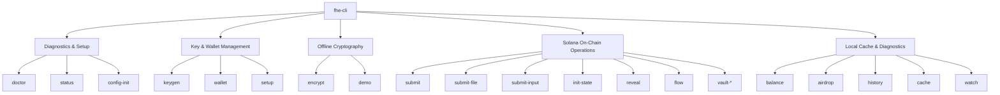

# 🛠️ FHESTATE Developer CLI Command Reference (`fhe-cli`)

The definitive engineering manual for `fhe-cli`—the core command-line utility for managing lattice-based Fully Homomorphic Encryption (FHE) keys, executing client-side encryption, managing local content-addressed ciphertext caches, and orchestrating on-chain Solana state transitions.

[](#)
[](#)
[](#)

---

## 🗺️ CLI Command Navigator



---

## ⚙️ 1. Global Setup & Installation

To compile the developer CLI directly from source:

```bash
# 1. Navigate to your Rust workspace
cd fhestate-rs

# 2. Build the optimized release binary
cargo build --release --bin fhe-cli

# 3. Check the binary execution
./target/release/fhe-cli --help
```

---

## 🛠️ 2. Global Precedence & Configuration

`fhe-cli` loads its network context, wallet configuration, and cryptographic anchors according to a strict **4-tier configuration hierarchy**:

| Priority | Level | Description |
| :--- | :--- | :--- |
| **1 (Highest)** | **CLI Flags** | Explicitly passed flags on the command prefix (e.g. `--rpc-url <URL>`) |
| **2** | **Environment Variables** | Session variables like `FHESTATE_RPC` or `FHESTATE_WALLET_PATH` |
| **3** | **`.fhestate/config.json`** | Project-level local JSON configuration generated by `config-init` |
| **4 (Lowest)** | **Internal Defaults** | Built-in fallback parameters (SPL Memo program, local directories) |

### Global Command Flags
```text
Options:
  -r, --rpc-url <RPC_URL>      Solana JSON-RPC Endpoint (Default: Devnet)
  -p, --program <PROGRAM_ID>   Coordinator program ID (Default: SPL Memo)
  -w, --wallet <WALLET_PATH>   Path to Solana keypair JSON (Default: deploy-wallet.json)
  -h, --help                   Print help information
```

### Config Schema (`.fhestate/config.json`)
```json
{
  "rpc_url": "https://api.devnet.solana.com",
  "program_id": "MemoSq4gqABAXKb96qnH8TysNcWxMyWCqXgDLGmfcHr",
  "wallet_path": "deploy-wallet.json",
  "key_dir": "fhe_keys",
  "cache_dir": ".fhe_cache"
}
```

---

## 📡 3. Complete 17 Subcommand Reference

### 1. `demo`
Executes an automated, complete client-side loop: runs diagnostics, creates mock FHE keys, initializes a Devnet wallet, encrypts a value, submits an SPL Memo transaction, and reports the Solscan verification URL.
* **Syntax**: `fhe-cli demo [--value <NUM>]`
* **Default Value**: `1337`
* **Output Logs**:
  ```text
  [INFO] Initiating one-shot protocol demo...
  [OK]   FHE Keys verified at ./fhe_keys
  [OK]   Wallet balance: 1.24 SOL
  [INFO] Encrypting u32 value 1337Homomorphically...
  [OK]   Ciphertext cached: local://a3f9b2c1d4... (Size: 32768 bytes)
  [INFO] Sending Solana transaction...
  [OK]   Success! Tx Signature: 4w9MESyqbMTkvNZAVn1uLBz1tD8onSuwEqh4yjaxrZLaUvKM7Wf63etQcjvC6XMuRso7auGpH6chFQC6YGyAJ41f
  [INFO] Solscan link: https://solscan.io/tx/4w9MESyqbMTkvNZAVn1uLBz1tD8onSuwEqh4yjaxrZLaUvKM7Wf63etQcjvC6XMuRso7auGpH6chFQC6YGyAJ41f?cluster=devnet
  ```

---

### 2. `doctor`
Performs complete, deep-dive checks of the system environment: validates lattice cryptography keys, tests Devnet connection latency, parses the Solana wallet JSON file, and tests Devnet SOL balances.
* **Syntax**: `fhe-cli doctor`
* **Output Logs**:
  ```text
  ═══════════════════════════════════════════════════════════
                      FHESTATE SYSTEM DIAGNOSTICS
  ═══════════════════════════════════════════════════════════
  [✓] RPC Node Connectivity : Devnet (https://api.devnet.solana.com) - Latency: 142ms
  [✓] Wallet Keypair File  : Checked (deploy-wallet.json) - Submitter: 69ZLYx...GkW
  [✓] Devnet SOL Balance    : 2.50 SOL (Sufficient for ~125 transactions)
  [✓] FHE Cryptography Keys : Valid client_key.bin (Secret) & server_key.bin (Public)
  [✓] Registry Cache Status : Checked (.fhe_cache registry is ready)
  STATUS: SYSTEM IS HEALTHY (All checks passed)
  ```

---

### 3. `status`
Summarizes the configuration, caching, and account anchors.
* **Syntax**: `fhe-cli status`
* **Output Logs**:
  ```text
  [STATUS] CONFIGURATION OVERVIEW
    - RPC Endpoint : https://api.devnet.solana.com
    - Program ID   : MemoSq4gqABAXKb96qnH8TysNcWxMyWCqXgDLGmfcHr (SPL Memo)
    - Submitter    : 69ZLYxGHckZDCBaDfzp5qh444wQXdETGTKPoetVAdBkW
    - Cache Files  : 14 cached ciphertexts (~448 KB)
    - Local Keys   : client_key.bin (OK), server_key.bin (OK)
  ```

---

### 4. `config-init`
Generates the default local JSON configuration file inside the `.fhestate/` directory to anchor workspace options.
* **Syntax**: `fhe-cli config-init [--force]`
* **Output Logs**:
  ```text
  [INFO] Generating configuration manifest...
  [OK]   Configuration written successfully to .fhestate/config.json
  ```

---

### 5. `keygen`
Generates a highly secure, lattice-based FHE key pair (Secret Client Key and Public Server Key) for u32 Fully Homomorphic calculations.
* **Syntax**: `fhe-cli keygen [--out <DIR>] [--force]`
* **Parameters**:
  * `--out <DIR>` — Target directory (Default: `fhe_keys`)
  * `--force` — Overwrite existing keys
* **Output Logs**:
  ```text
  [INFO] Generating lattice FHE key pair (Security level: 128-bit, TFHE)...
  [INFO] [CPU-Intensive] Processing bootstrap keyset. Please wait...
  [OK]   Client secret key written to: fhe_keys/client_key.bin
  [OK]   Server public key written to: fhe_keys/server_key.bin
  ```

---

### 6. `wallet`
Provides native subcommand utilities to generate or manage local Solana account files.
* **Syntax**:
  * `fhe-cli wallet new [--out <PATH>]`
* **Parameters**:
  * `--out <PATH>` — Directory or filename path (Default: `deploy-wallet.json`)
* **Output Logs**:
  ```text
  [INFO] Generating new Solana Devnet Keypair...
  [OK]   Account Public Key : 69ZLYxGHckZDCBaDfzp5qh444wQXdETGTKPoetVAdBkW
  [OK]   Keypair saved to   : deploy-wallet.json
  [WARNING] Keep deploy-wallet.json safe. Never share private keys!
  ```

---

### 7. `setup`
Initiates the first-time setup protocol anchor. Validates the existence of the Solana wallet and the lattice FHE keys. If keys or wallets are missing, it initializes them.
* **Syntax**: `fhe-cli setup`
* **Output Logs**:
  ```text
  [INFO] Running first-time setup checks...
  [WARN] Wallet not found at deploy-wallet.json. Initializing...
  [OK]   Wallet generated successfully.
  [WARN] FHE keys not found at ./fhe_keys. Initializing keygen...
  [OK]   Keys generated successfully.
  [OK]   Protocol Setup Complete.
  ```

---

### 8. `encrypt`
Perform offline, client-side FHE encryption of a raw u32 integer. Generates the content-addressed ciphertext hash, caches it locally inside `.fhe_cache/`, and writes the compiled raw binary payload to a target file.
* **Syntax**: `fhe-cli encrypt --value <NUM> --out <FILE_PATH>`
* **Arguments**:
  * `--value <NUM>` — Plainttext `u32` value to encrypt.
  * `--out <FILE_PATH>` — Filename for output raw ciphertext binary.
* **Output Logs**:
  ```text
  [INFO] Encrypting plaintext u32 value: 42
  [INFO] Serializing ciphertext binary...
  [OK]   Ciphertext written locally to: ct.bin (32768 bytes)
  [OK]   Stored in registry cache: local://d6f7a8b9c0...
  ```

---

### 9. `submit`
Performs client-side encryption of a u32 integer, commits the raw ciphertext to the local content-addressed cache, and dispatches a Solana transaction referencing the ciphertext hash.
* **Syntax**: `fhe-cli submit --op <OP_CODE> --value <VALUE>`
* **Arguments**:
  * `--op <OP_CODE>` — Target mathematical operation code (e.g. `0` = ADD, `1` = SUB, `30` = VOTE).
  * `--value <VALUE>` — Plaintext `u32` integer input.
* **Output Logs**:
  ```text
  [INFO] Encrypting client value: 100
  [OK]   Ciphertext serialized: local://3c9e8d7a1f...
  [INFO] Launching Solana transaction...
  [OK]   Transaction processed!
  [OK]   Signature: 5yH3mJ...8bN
  ```

---

### 10. `submit-file`
Submits a pre-encrypted FHE ciphertext binary payload directly to the Solana blockchain. Resolves the file, calculates the content hash, registers it in cache, and submits the pointer.
* **Syntax**: `fhe-cli submit-file --file <FILE_PATH>`
* **Arguments**:
  * `--file <FILE_PATH>` — Location of the `.bin` ciphertext payload.
* **Output Logs**:
  ```text
  [INFO] Resolving FHE ciphertext from file: ct.bin
  [INFO] Verification: Valid u32 ciphertext detected (SHA-256: 4f8b2c...)
  [INFO] Registering in local cache...
  [INFO] Submitting pointer local://4f8b2c... to Solana...
  [OK]   Transaction processed! Hash: 3nB1vK...6pP
  ```

---

### 11. `submit-input`
Submits an inline task parameter directly to the on-chain Coordinator program. Creates or links to an active `Task` state account.
* **Syntax**: `fhe-cli submit-input --value <NUM> [--op <NUM>]`
* **Arguments**:
  * `--value <NUM>` — Plaintext parameter to encrypt.
  * `--op <NUM>` — Operation ID (Default: `0` = ADD).
* **Output Logs**:
  ```text
  [INFO] Submitting input parameter to Coordinator...
  [OK]   PDA State Task Account linked.
  [OK]   Transaction sent: 2pM7vS...9fJ
  ```

---

### 12. `init-state`
Initializes a new `StateContainer` Program Derived Address (PDA) on the Solana network to hold on-chain references to your FHE program's encrypted state variables.
* **Syntax**: `fhe-cli init-state`
* **Output Logs**:
  ```text
  [INFO] Initializing StateContainer PDA...
  [OK]   PDA Address resolved: 8H7vZ...3nP
  [INFO] Submitting transaction...
  [OK]   StateContainer created successfully. Signature: 4eK8m...8vQ
  ```

---

### 13. `reveal`
Requests the background FHE Node compute cluster to decrypt and reveal the output of an on-chain computation task.
* **Syntax**: `fhe-cli reveal --task <TASK_PUBKEY>`
* **Arguments**:
  * `--task <TASK_PUBKEY>` — Public key of the target `Task` account.
* **Output Logs**:
  ```text
  [INFO] Submitting Reveal instruction for Task: 3nB9m...4vR
  [INFO] Waiting for FHE computation node decryption...
  [OK]   Task revealed successfully!
  [OK]   Decrypted Output: 242
  ```

---

### 14. `balance`
Fetches and formats the current Devnet SOL balance of your local keypair wallet.
* **Syntax**: `fhe-cli balance`
* **Output Logs**:
  ```text
  [INFO] Fetching wallet balance from Devnet RPC...
  [OK]   Submitter Key : 69ZLYxGHckZDCBaDfzp5qh444wQXdETGTKPoetVAdBkW
  [OK]   Balance        : 1.78 SOL
  ```

---

### 15. `airdrop`
Requests a Devnet faucet airdrop of Solana lamports to your active wallet.
* **Syntax**: `fhe-cli airdrop <SOL_AMOUNT>`
* **Arguments**:
  * `<SOL_AMOUNT>` — Number of Devnet SOL to request (e.g. `1` or `1.5`).
* **Output Logs**:
  ```text
  [INFO] Sending airdrop request for 1.5 SOL to faucet...
  [INFO] Awaiting transaction confirmation...
  [OK]   Airdrop successful! Wallet balance is now: 3.28 SOL
  ```

---

### 16. `history`
Fetches and logs the most recent on-chain transactions sent from your active local developer wallet.
* **Syntax**: `fhe-cli history [--limit <NUM>]`
* **Arguments**:
  * `--limit <NUM>` — Max logs to display (Default: `10`).
* **Output Logs**:
  ```text
  [INFO] Loading last 3 transactions for 69ZLYx...
  
  1. Signature: 4w9MESyqbMTkvNZAVn1u...
     Slot: 274381920 | Status: CONFIRMED
     Type: FHE_TASK_SUBMISSION (OP=0)
  
  2. Signature: 3nB1vKyqbMTkvNZAVn1u...
     Slot: 274381810 | Status: CONFIRMED
     Type: PDA_INITIALIZATION
  ```

---

### 17. `cache`
Inspects and manages your local content-addressed FHE ciphertext directory (`.fhe_cache/`).
* **Syntax**:
  * `fhe-cli cache list` — Lists all cached ciphertext URIs and sizes.
  * `fhe-cli cache show <HASH>` — Inspects a specific cached ciphertext file.
* **Output Logs**:
  ```text
  [CACHE] Stored Ciphertexts:
    - local://a3f9b2c1d4... | Size: 32768 bytes | Created: 2026-05-20
    - local://d6f7a8b9c0... | Size: 32768 bytes | Created: 2026-05-22
  [CACHE] Total: 2 cached objects (65536 bytes)
  ```

---

### 18. `watch`
Initiates real-time, active polling of your local Solana wallet. Automatically detects on-chain status updates and displays transaction signature logs.
* **Syntax**: `fhe-cli watch [--interval <SECONDS>]`
* **Arguments**:
  * `--interval <SECONDS>` — Polling interval (Default: `5` seconds).
* **Output Logs**:
  ```text
  [INFO] Polling Devnet transactions for wallet: 69ZLYx...
  [INFO] Press Ctrl+C to terminate watch stream.
  [POLL] [05:14:10] Listening for new transactions... (Latency: 140ms)
  [POLL] [05:14:15] Listening for new transactions...
  [TX]   [05:14:18] New Transaction Detected!
         - Signature: 5yH3mJkY...
         - Status: Confirmed
  ```

---

### 19. `flow`
Orchestrates high-level automated execution flows for testing on-chain programs.
* **Syntax**: `fhe-cli flow <FLOW_NAME> [--value <NUM>]`
* **Arguments**:
  * `<FLOW_NAME>` — Name of the flow script (e.g. `counter`).
  * `--value <NUM>` — Initial input parameter (Default: `1`).
* **Output Logs**:
  ```text
  [INFO] Launching execution flow: counter
  [1/3]  Checking StateContainer PDA existence...
  [OK]   PDA resolved: 8H7vZ...3nP (Already initialized)
  [2/3]  Submitting FHE transaction...
  [OK]   FHE operation ADD submitted. Tx: 4eK8m...
  [3/3]  Verifying result transition...
  [OK]   Transaction confirmed on-chain. Flow completed!
  ```

---

## ⚡ 4. Cryptographic Pipeline Architecture

The following diagram illustrates the data flow within the FHESTATE system when a developer executes a `submit` instruction via `fhe-cli`:

```text
  +------------------+
  |  fhe-cli submit  |
  +--------+---------+
           |
           v (Encrypt Value)
  +--------+---------+
  |    KeyManager    | <--- Loads client_key.bin
  +--------+---------+
           |
           v (FheUint32 Ciphertext ~32KB)
  +--------+---------+
  |    LocalCache    | ---> Computes SHA-256 Hash
  +--------+---------+ ---> Saves to .fhe_cache/<sha256>.bin
           |
           v (local://<sha256> URI)
  +--------+---------+
  |   Solana RPC     | <--- Signs Tx with deploy-wallet.json
  +--------+---------+
           |
           v (Tx broadcasted to Devnet)
  +--------+---------+
  |    Blockchain    | ---> Updates StateContainer PDA
  +------------------+
```

---

## 🛡️ 4. Shielded Vault Homomorphic Helpers

Implemented in `bin/fhe-cli/vault_ops.rs`. Each command prints **JSON to stdout**. Pair outputs with `fhestate-sdk` instruction builders or integration binaries in `src/bin/`.

**Vault program (Devnet):** `FuQzZCwPSRSVLT9gCgcft43a4RkapBJmSTC6CmdomeVQ`

| Command | Flags | JSON output keys |
| :--- | :--- | :--- |
| `vault-transfer-hashes` | `--sender-balance-uri`, `--receiver-balance-uri`, `--amount-lamports` | `sender_hash`, `receiver_hash`, `sender_uri`, `receiver_uri` |
| `vault-deposit-hash` | `--balance-uri`, `--deposit-lamports` | `new_balance_hash`, `new_balance_uri` |
| `vault-swap-hash` | `--current-balance-uri`, `--amount-in-lamports`, `--amount-out-lamports` | `new_balance_hash`, `new_balance_uri` |
| `dao-tally-vote` | `--tally-uri`, `--vote-ciphertext-hex` | `new_state_hash`, `new_state_uri` |
| `store-ciphertext` | `--ciphertext-hex` | `hash`, `uri` |
| `decrypt-u32` | `--uri-or-hex` | `value`, `uri` |
| `check-spending` | `--daily-spend-uri`, `--proposed-lamports`, `--limit-lamports` | `allowed`, `reason` |

### Example: vault swap hash

```bash
./target/release/fhe-cli vault-swap-hash \
  --current-balance-uri local://abc123... \
  --amount-in-lamports 50000 \
  --amount-out-lamports 48000
```

```json
{"new_balance_hash":"<sha256>","new_balance_uri":"local://<sha256>"}
```

Feed `new_balance_hash` into `shielded_swap_proxy`. Full on-chain reference: [SHIELDED-VAULT-PROGRAM.md](./SHIELDED-VAULT-PROGRAM.md). API detail: [API.md](./API.md#shielded-vault-homomorphic-commands-fhe-cli).

---

## 🚀 5. Practical End-to-End Walkthroughs

### Walkthrough A: One-Shot SPL Memo Demo (Zero Config)
The simplest way to verify the entire cryptographic toolchain locally and on-chain:

```bash
# 1. Run first-time environment initialization
./target/release/fhe-cli setup

# 2. Get some Devnet SOL
./target/release/fhe-cli airdrop 1.5

# 3. Submit a one-shot demo transaction with value 100
./target/release/fhe-cli demo --value 100
```

### Walkthrough B: Full Coordinator State Transition Flow
For production-grade, state-preserving Fully Homomorphic computation on Solana:

```bash
# 1. Initialize config.json targeting the Coordinator program
./target/release/fhe-cli config-init

# 2. Generate keypair to represent the state anchor
./target/release/fhe-cli init-state

# 3. Submit addition command (Value: 42, Operation: ADD)
./target/release/fhe-cli submit --op 0 --value 42

# 4. Monitor state transaction confirmation
./target/release/fhe-cli watch --interval 2
```

### Walkthrough C: Shielded Vault Devnet flow

```bash
# 1. Keys + wallet (see QUICKSTART.md)
cargo run --release --bin fhe_proof -- keygen --out-dir fhe_keys

# 2. Off-chain swap math → JSON hash
./target/release/fhe-cli vault-swap-hash \
  --amount-in-lamports 50000 --amount-out-lamports 48000

# 3. Full on-chain enclave + swap E2E
cargo build --release --bin devnet_vault_enclave_flow
./target/release/devnet_vault_enclave_flow
```

---

## 🩺 6. Advanced Troubleshooting Matrix

If you encounter errors during setup or deployment, refer to the diagnostic matrix below:

| Diagnostic Log | Underlying Root Cause | Definitive Resolution |
| :--- | :--- | :--- |
| `Error: KeyNotFound` | FHE Client or Server keys missing from directories. | Execute `fhe-cli keygen` or run `fhe-cli setup` to regenerate standard keys. |
| `Error: InsufficientFunds` | Submitter wallet SOL balance is less than `0.005 SOL`. | Run `fhe-cli airdrop 1.5` or request lamports directly from `https://faucet.solana.com`. |
| `Error: CacheMiss(local://...)` | local content-addressed ciphertext cache has been cleared or deleted. | Re-encrypt your plaintext file using `fhe-cli encrypt --value <V> --out ct.bin` to restore the cache entry. |
| `Error: Global Flag Position` | `--program` or `--rpc-url` flags were placed *after* subcommands. | Reposition global options *before* subcommands: `./target/release/fhe-cli --program <ID> submit`. |
| `HTTP 429: Too Many Requests` | Solana public RPC endpoint or Airdrop faucet is rate-limiting your IP. | Wait 60 seconds, or update `rpc_url` in `.fhestate/config.json` to use a private endpoint (e.g. Helius, QuickNode). |
