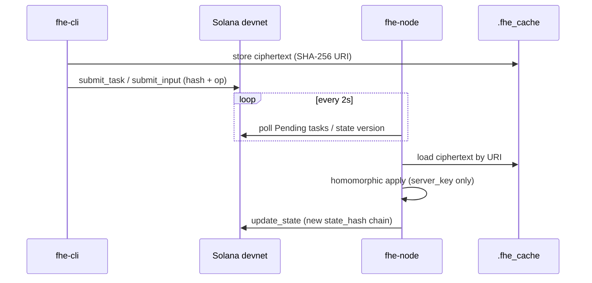

# Decentralized Compute — FHESTATE-rs

**Homomorphic execution on encrypted tasks without plaintext on the executor.**

This document describes the **compute layer** (`fhe-node`) and how it fits the five-layer decentralized compute stack used by the FHESTATE portal and MCP tooling.

---

## Five-layer stack

| Layer | Component | Role |
| --- | --- | --- |
| 1 | `fhe-cli` + TFHE-rs | Encrypt off-chain; `client_key` never leaves the host |
| 2 | Shielded Vault | On-chain TEE registry, MRENCLAVE, attestation authority |
| 3 | **`fhe-node`** | Poll devnet, run homomorphic ops on ciphertext, update state hashes |
| 4 | MCP agents (`mcp/fhestate-mcp`) | Blind steps on encrypted intents via the separate MCP server |
| 5 | Devnet anchor | SPL Memo / API anchor — public proof without plaintext |

Try the full stack in the utility: **[app.fhestate.org/compute](https://app.fhestate.org/compute)**.

---

## fhe-node executor lifecycle



### Task states

From `bin/fhe-node/service.rs`:

- **Pending** — task posted on-chain, waiting for executor
- **Processing** — node claimed work, running TFHE-rs
- **Completed** — state hash updated on-chain
- **Failed** — execution error (logged, no plaintext leak)

The node holds only the **server key**. It cannot decrypt user plaintext.

---

## Build and run

```bash
cd fhestate-rs
cargo build --release -p fhe-cli -p fhe-node

# Diagnostics
./target/release/fhe-cli doctor
./target/release/fhe-cli status

# Executor (requires deploy-wallet.json + fhe_keys/server_key.bin)
./target/release/fhe-node \
  --rpc-url https://api.devnet.solana.com \
  --wallet deploy-wallet.json \
  --server-key fhe_keys/server_key.bin
```

---

## Operator health check

Before running the executor, verify keys, wallet, and RPC from the CLI:

```bash
./target/release/fhe-cli doctor
./target/release/fhe-cli status
```

For MCP-based automation, configure the real server at `mcp/fhestate-mcp` in Cursor.

---

## SDK path (browser encrypt → coordinator)

The TypeScript SDK can encrypt in-browser and submit to the coordinator program:

```typescript
import { encryptAndSubmitInput } from "fhestate-sdk/browser";
```

See [`fhestate-sdk/docs/SOLANA-INTEGRATION.md`](../../fhestate-sdk/docs/SOLANA-INTEGRATION.md) and `browser-transactions.ts` for `submit_input` when the coordinator is deployed.

---

## Related docs

- [ARCHITECTURE.md](./ARCHITECTURE.md) — full system diagram
- [CLI.md](./CLI.md) — fhe-cli commands
- [QUICKSTART.md](./QUICKSTART.md) — first encrypt + anchor
- [SHIELDED-VAULT-PROGRAM.md](./SHIELDED-VAULT-PROGRAM.md) — on-chain vault reference
