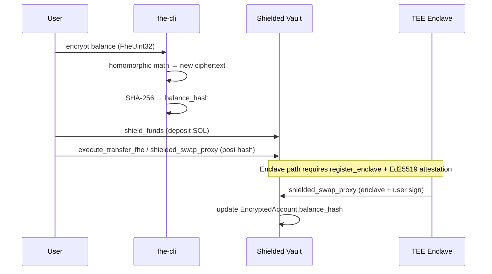

# Shielded Vault Program

**Complete on-chain reference for `programs/shielded_vault` — confidential SOL custody, FHE balance commitments, TEE enclave authorization, and in-vault governance on Solana Devnet.**

| Field | Value |
|-------|-------|
| **Program ID (Devnet)** | `FuQzZCwPSRSVLT9gCgcft43a4RkapBJmSTC6CmdomeVQ` |
| **Framework** | Anchor |
| **Source** | `programs/shielded_vault/src/lib.rs` |
| **Off-chain FHE engine** | TFHE-rs `FheUint32` via `fhe-cli` / `fhestate-sdk` |
| **On-chain storage model** | SHA-256 hash commitments (not raw ciphertext) |

---

## Overview

The Shielded Vault is FHESTATE's confidential asset layer on Solana. Users deposit native SOL into a program-controlled escrow account. Their **private balance** is never written to the chain as plaintext or as a 32 KB ciphertext. Instead, each user holds an `EncryptedAccount` PDA containing a 32-byte `balance_hash` — a SHA-256 digest of the serialized homomorphic balance ciphertext computed off-chain.

This split design keeps transactions small and rent-efficient while preserving privacy: observers see only hash updates and public SOL movements into the vault. Only the holder of `client_key.bin` can decrypt the underlying `FheUint32` balance.

The program supports three authorization paths for updating balance commitments:

1. **Admin** — direct policy and transfer hash updates (`execute_transfer_fhe`, `unshield_funds`).
2. **Registered TEE enclave** — attestation-gated signers for swaps, TEE transfers, unshield, batch updates, and DAO votes.
3. **User** — SOL deposits via `shield_funds` and account initialization.

---

## How it works (end-to-end)



**Typical shield → transfer flow:**

1. User calls `initialize_account()` once to create their `EncryptedAccount` PDA.
2. User calls `shield_funds(amount)` — SOL moves from wallet to `vault_auth`; `total_liquidity` increases.
3. Off-chain: `fhe-cli vault-deposit-hash` adds the deposit amount homomorphically and returns `new_balance_hash`.
4. Admin or enclave posts the hash via `execute_transfer_fhe_tee` or a follow-up instruction.
5. To withdraw: off-chain balance check → `unshield_funds` or `unshield_funds_tee` releases SOL from vault.

**Typical confidential swap flow:**

1. Admin sets `approved_mrenclave` and rotates `attestation_authority` if needed.
2. Enclave registers via `register_enclave` with Ed25519 precompile attestation at the prior instruction index.
3. Off-chain: `fhe-cli vault-swap-hash` computes post-swap `new_balance_hash`.
4. User + enclave co-sign `shielded_swap_proxy(amount_in, min_amount_out, new_balance_hash)`.
5. Program transfers `amount_in` lamports to vault and writes the new hash; `SwapEvent` is emitted.

---

## Program Derived Addresses

Every persistent account is a PDA derived deterministically from seeds. Wallets and integrators can compute addresses without an RPC lookup.

| Account | Seeds | Space (bytes) | Purpose |
|---------|-------|---------------|---------|
| `VaultRegistry` | `[b"vault_registry"]` | `8 + 408` | Global config: admin, attestation, limits, liquidity |
| `Vault` (SOL escrow) | `[b"vault_auth"]` | System account | Holds shielded SOL; receives CPI transfers |
| `EncryptedAccount` | `[b"enc_account", owner_pubkey]` | `8 + 64` | Per-user `balance_hash` commitment |
| `EnclaveAccount` | `[b"enclave", enclave_pubkey]` | `8 + 33` | Registered TEE signer + active flag |
| `Proposal` | `[b"proposal", proposal_id.to_le_bytes()]` | `8 + 73` | In-vault governance tally commitments |

**Discriminator convention:** All instructions use Anchor-style discriminators: `sha256("global:<instruction_snake_name>")[0..8]`.

The `vault_auth` PDA is not allocated inside `initialize_vault`. It is referenced as an unchecked system account and accumulates lamports when users call `shield_funds` or when swaps route funds into the vault. Ensure it remains rent-exempt before small transfers (integration scripts pre-fund it when needed).

---

## Account layouts

### `VaultRegistry` — global vault state

The registry is the single source of truth for admin identity, TEE policy, spending controls, and aggregate liquidity.

| Offset | Size | Field | Type | Description |
|--------|------|-------|------|-------------|
| 0 | 8 | Anchor discriminator | — | Account type tag |
| 8 | 32 | `admin` | `Pubkey` | Sole admin for policy instructions |
| 40 | 32 | `attestation_authority` | `Pubkey` | Ed25519 key that signs enclave attestations |
| 72 | 8 | `total_liquidity` | `u64` | Sum of shielded SOL in the vault (lamports) |
| 80 | 32 | `approved_mrenclave` | `[u8; 32]` | Approved enclave binary measurement |
| 112 | 32 | `spending_limit_hash` | `[u8; 32]` | SHA-256 of treasury limit ciphertext |
| 144 | 256 | `encrypted_daily_limit` | `[u8; 256]` | Encrypted daily spending limit blob |
| 400 | 8 | `transaction_threshold` | `u64` | Public alert threshold (lamports) |

The `transaction_threshold` is stored in plaintext and is intended for monitoring or alerting — it does not enforce spending by itself. Enforcement of encrypted limits happens off-chain via `fhe-cli check-spending` before signing transactions.

### `EncryptedAccount` — per-user balance commitment

| Offset | Size | Field | Type | Description |
|--------|------|-------|------|-------------|
| 8 | 32 | `owner` | `Pubkey` | Wallet that owns this encrypted balance |
| 40 | 32 | `balance_hash` | `[u8; 32]` | SHA-256 of current `FheUint32` balance ciphertext |

A zero hash means uninitialized balance. After any homomorphic operation, integrators must recompute `SHA-256(bincode::serialize(ciphertext))` and verify it matches the on-chain value before decrypting locally.

### `EnclaveAccount` — TEE signer registration

| Offset | Size | Field | Type | Description |
|--------|------|-------|------|-------------|
| 8 | 32 | `enclave_key` | `Pubkey` | Enclave's Ed25519 signing pubkey |
| 40 | 1 | `is_active` | `bool` | Admin can disable without deleting the PDA |

Inactive enclaves cannot call `shielded_swap_proxy`, TEE transfer/unshield, `submit_dao_vote`, or `execute_multi_transfer_fhe_tee`.

### `Proposal` — in-vault governance tallies

| Offset | Size | Field | Type | Description |
|--------|------|-------|------|-------------|
| 8 | 8 | `proposal_id` | `u64` | Unique proposal identifier |
| 16 | 32 | `tally_yes_hash` | `[u8; 32]` | Homomorphic yes-vote tally commitment |
| 48 | 32 | `tally_no_hash` | `[u8; 32]` | Homomorphic no-vote tally commitment |
| 80 | 1 | `is_active` | `bool` | Whether votes are accepted |

These proposals live inside the Shielded Vault program (separate from the standalone Dark DAO program at `Ay5Z1HQrsfnYNhRt48Mujr7k1b91bV7ir4jATYocVp5s`). Use `fhe-cli dao-tally-vote` off-chain to accumulate encrypted votes before an enclave posts updated hashes via `submit_dao_vote`.

---

## Instruction reference

The program exposes **19 instructions** grouped by responsibility below. Each entry includes purpose, authorization, and the account table where applicable.

### Registry and account lifecycle

#### `initialize_vault(attestation_authority: Pubkey)`

**Purpose:** One-time creation of the `VaultRegistry` PDA. Sets the deploying signer as `admin`, stores the initial `attestation_authority`, and zeroes liquidity, MRENCLAVE, and limit fields.

**Who may call:** Any signer paying rent (becomes `admin`).

| # | Account | Signer | Writable |
|---|---------|--------|----------|
| 0 | `registry` (PDA) | — | ✅ init |
| 1 | `authority` | ✅ | ✅ |
| 2 | `system_program` | — | — |

#### `initialize_account()`

**Purpose:** Creates the caller's `EncryptedAccount` PDA with `balance_hash = [0; 32]`. Required before balance hash updates or swaps target that user.

| # | Account | Signer | Writable |
|---|---------|--------|----------|
| 0 | `encrypted_account` (PDA) | — | ✅ init |
| 1 | `owner` | ✅ | ✅ |
| 2 | `system_program` | — | — |

#### `close_registry()`

**Purpose:** Admin-only teardown. Transfers all lamports from the `VaultRegistry` PDA to the admin and zeroes account data. Used by the `close_registry` integration binary for Devnet cleanup.

| # | Account | Signer | Writable |
|---|---------|--------|----------|
| 0 | `admin` | ✅ | ✅ |
| 1 | `registry` (PDA) | — | ✅ |

---

### Liquidity: shield, unshield, and transfers

#### `shield_funds(amount: u64)`

**Purpose:** User deposits SOL into the vault escrow. Increments `registry.total_liquidity` and emits `ShieldEvent`. Does not update `balance_hash` — that happens in a separate off-chain + on-chain step.

| # | Account | Signer | Writable |
|---|---------|--------|----------|
| 0 | `user` | ✅ | ✅ |
| 1 | `vault` (`vault_auth` PDA) | — | ✅ |
| 2 | `registry` | — | ✅ |
| 3 | `system_program` | — | — |

**Off-chain companion:** `fhe-cli vault-deposit-hash --deposit-lamports <amount>`

#### `unshield_funds(amount: u64, vault_bump: u8)`

**Purpose:** Admin withdraws SOL from `vault_auth` to the user account. Decrements `total_liquidity`. The vault PDA must sign the outgoing transfer using `vault_bump`.

**Who may call:** `registry.admin` only.

#### `execute_transfer_fhe(new_sender_hash, new_receiver_hash)`

**Purpose:** Admin posts updated balance commitments for a confidential transfer after off-chain homomorphic debit/credit. Does not move SOL — only updates both `EncryptedAccount.balance_hash` fields.

**Who may call:** `registry.admin`.

**Off-chain companion:** `fhe-cli vault-transfer-hashes --amount-lamports <amount>`

#### `unshield_funds_tee(amount: u64, vault_bump: u8)`

**Purpose:** Same SOL release as `unshield_funds`, but authorization requires an **active registered enclave** whose signer matches `EnclaveAccount.enclave_key`.

#### `execute_transfer_fhe_tee(new_sender_hash, new_receiver_hash)`

**Purpose:** Enclave-authorized confidential transfer. Updates sender and receiver balance hashes without admin involvement.

#### `execute_multi_transfer_fhe_tee(updates: Vec<AccountHashUpdate>)`

**Purpose:** Batch enclave-authorized hash updates for multiple accounts in one transaction. Each `AccountHashUpdate` is `{ account_key: Pubkey, new_hash: [u8; 32] }`. Matching `EncryptedAccount` accounts must appear in `remaining_accounts`; the program writes `new_hash` to bytes `[40..72]` of each account's data.

Useful for splitter-style payouts where one enclave attests to several balance changes atomically.

---

### Admin policy controls

All instructions in this group require `signer == registry.admin`.

| Instruction | Arguments | What it does |
|-------------|-----------|--------------|
| `update_attestation_authority` | `new_authority: Pubkey` | Rotates the Ed25519 key that must sign enclave registration attestations |
| `update_approved_mrenclave` | `new_mrenclave: [u8; 32]` | Sets the approved enclave binary measurement (MRENCLAVE) |
| `update_treasury_limit` | `new_limit_hash: [u8; 32]` | Stores SHA-256 of the treasury spending limit ciphertext |
| `update_daily_limit` | `new_limit: [u8; 256]` | Stores the full encrypted daily spending limit blob |
| `update_transaction_threshold` | `new_threshold: u64` | Sets a public lamport threshold for monitoring/alerts |

**Operational note:** Rotate `attestation_authority` and `approved_mrenclave` before registering production enclaves. The `register_enclave` instruction rejects attestations signed by a stale authority or bearing a non-approved MRENCLAVE.

---

### TEE enclave lifecycle

#### `register_enclave(enclave_key: Pubkey)`

**Purpose:** Creates an `EnclaveAccount` PDA for `enclave_key` with `is_active = true`, but only after cryptographic proof that the enclave matches on-chain policy.

**Transaction layout:** The instruction immediately preceding `register_enclave` in the transaction **must** be the Solana `Ed25519SigVerify` precompile. The program reads that instruction via the instructions sysvar at index `current_index - 1`.

**Attestation payload (64 bytes signed):**

```
[ enclave_pubkey (32 bytes) | approved_mrenclave (32 bytes) ]
```

Signed by `VaultRegistry.attestation_authority`.

**On-chain verification steps:**

1. Prior instruction is the Ed25519 verify program.
2. Signed message length is exactly 64 bytes.
3. Signer pubkey equals `attestation_authority`.
4. Bytes `[0..32]` of the message equal the `enclave_key` argument.
5. Bytes `[32..64]` equal `registry.approved_mrenclave`.

| # | Account | Signer | Writable |
|---|---------|--------|----------|
| 0 | `authority` (admin) | ✅ | ✅ |
| 1 | `registry` | — | — |
| 2 | `enclave_account` (PDA) | — | ✅ init |
| 3 | `instructions` (sysvar) | — | — |
| 4 | `system_program` | — | — |

#### `toggle_enclave(is_active: bool)`

**Purpose:** Admin enables or disables an existing enclave without closing its PDA. Disabled enclaves fail all enclave-gated instructions with `UnauthorizedEnclave`.

#### `shielded_swap_proxy(amount_in, min_amount_out, new_balance_hash)`

**Purpose:** Confidential swap authorized by a registered active enclave. Transfers `amount_in` lamports from the user to the vault via system program CPI, sets `encrypted_account.balance_hash = new_balance_hash`, and emits `SwapEvent`. The `min_amount_out` parameter is recorded in the event for off-chain verification; slippage enforcement is the integrator's responsibility before signing.

**Signers required:** `enclave_signer` (must match registered PDA) and `user` (fee payer / swap initiator).

| # | Account | Signer | Writable |
|---|---------|--------|----------|
| 0 | `enclave_signer` | ✅ | — |
| 1 | `enclave_account` (PDA) | — | — |
| 2 | `registry` | — | ✅ |
| 3 | `user` | ✅ | ✅ |
| 4 | `encrypted_account` | — | ✅ |
| 5 | `vault` (`vault_auth`) | — | ✅ |
| 6 | `system_program` | — | — |

**Off-chain companion:** `fhe-cli vault-swap-hash` → use `new_balance_hash` in this instruction.

---

### In-program governance

#### `initialize_proposal(proposal_id: u64)`

**Purpose:** Creates a `Proposal` PDA with zeroed yes/no tally hashes and `is_active = true`.

#### `submit_dao_vote(new_yes_hash, new_no_hash)`

**Purpose:** Active enclave updates encrypted yes/no tally commitments on an active proposal. Off-chain vote accumulation uses `fhe-cli dao-tally-vote` with `ops::VOTE_TALLY` before the enclave posts the resulting hashes.

---

## Events

Programs emit Anchor events for indexers and explorers.

| Event | Fields | When emitted |
|-------|--------|--------------|
| `ShieldEvent` | `user`, `amount` | After `shield_funds` |
| `SwapEvent` | `user`, `amount_in`, `min_amount_out`, `new_balance_hash` | After `shielded_swap_proxy` |

---

## Error codes (`VaultError`)

| Code | Name | Cause | Resolution |
|------|------|-------|------------|
| 6000 | `Unauthorized` | Signer is not `registry.admin` | Use admin keypair |
| 6001 | `UnauthorizedEnclave` | Enclave inactive or signer ≠ registered key | Call `toggle_enclave(true)` or fix signer |
| 6002 | `InvalidEd25519Instruction` | Missing/malformed Ed25519 precompile at ix −1 | Prepend valid `Ed25519SigVerify` instruction |
| 6003 | `InvalidAttestationMessage` | Signed message ≠ 64 bytes | Sign exactly `[enclave_key \| mrenclave]` |
| 6004 | `EnclaveKeyMismatch` | Attestation enclave key ≠ instruction arg | Align keys in attestation and `register_enclave` |
| 6005 | `InvalidMrenclave` | Attestation MRENCLAVE ≠ `approved_mrenclave` | Call `update_approved_mrenclave` first |
| 6006 | `InactiveProposal` | `submit_dao_vote` on closed proposal | Initialize or reactivate proposal |
| 6007 | `InvalidAccountData` | `EncryptedAccount` too short in multi-transfer | Pass valid account in `remaining_accounts` |
| 6008 | `AccountNotFound` | `remaining_accounts` missing a batch target | Include every `AccountHashUpdate.account_key` |

---

## Off-chain companion (`fhe-cli`)

Homomorphic math runs off-chain in `bin/fhe-cli/vault_ops.rs`. Commands print JSON to stdout for backends, the portal, and `fhestate-sdk` instruction builders. **None of these commands submit Solana transactions.**

| Command | When to use | JSON output |
|---------|-------------|-------------|
| `vault-transfer-hashes` | Before `execute_transfer_fhe*` | `sender_hash`, `receiver_hash`, `sender_uri`, `receiver_uri` |
| `vault-deposit-hash` | After `shield_funds` | `new_balance_hash`, `new_balance_uri` |
| `vault-swap-hash` | Before `shielded_swap_proxy` | `new_balance_hash`, `new_balance_uri` |
| `dao-tally-vote` | Before `submit_dao_vote` | `new_state_hash`, `new_state_uri` |
| `store-ciphertext` | Cache arbitrary ciphertext bytes | `hash`, `uri` |
| `decrypt-u32` | Verify balance locally (requires `client_key.bin`) | `value`, `uri` |
| `check-spending` | Pre-flight spending guard | `allowed`, `reason` |

Full command flags and examples: [CLI.md](./CLI.md#️-4-shielded-vault-homomorphic-helpers) · [API.md](./API.md#shielded-vault-homomorphic-commands-fhe-cli)

---

## Integration binaries (Devnet)

Pre-built Rust scripts in `src/bin/` exercise live Devnet flows against `FuQzZCwPSRSVLT9gCgcft43a4RkapBJmSTC6CmdomeVQ`. All require `deploy-wallet.json` and `fhe_keys/` (generate via `fhe_proof keygen`).

| Binary | What it demonstrates |
|--------|---------------------|
| `devnet_vault_flow` | Shield, homomorphic transfer hashes, unshield |
| `devnet_vault_flow_tee` | Attestation authority, MRENCLAVE, enclave registration |
| `devnet_vault_enclave_flow` | Daily limit, threshold, full `shielded_swap_proxy` E2E |
| `confidential_governance_flow` | `update_treasury_limit` + governance hash updates |
| `close_registry` | Admin `close_registry` teardown |

```bash
cargo build --release --bin devnet_vault_enclave_flow
./target/release/devnet_vault_enclave_flow
```

---

## Verified Devnet transactions (2026-06-17)

| Instruction | Signature |
|-------------|-----------|
| `update_attestation_authority` | [`RY77t39F...`](https://solscan.io/tx/RY77t39FVJbauHR1FvVYerNySWN4umdHzG1CrHKV7iSfZLqThkottBmk34EPXSzJkDqfRx7GHZBgvPnGXsYoLgj?cluster=devnet) |
| `update_approved_mrenclave` | [`3CVpwKf9...`](https://solscan.io/tx/3CVpwKf9Gwe7xGGX2USM8DDvFL46dFD5oZ7kVFZU8rLXvWx6BsiQKwvrkD3F3YfUxC1LU35qxTQPGxvP479ZpA2z?cluster=devnet) |
| `update_daily_limit` | [`gZVa4z5K...`](https://solscan.io/tx/gZVa4z5KjXj7ipmVAb7iq3ou6RCwk7rcWbkZ1mBYYUPwJmtyasWezQDgXFwYSuT7jSt19CdHWDcocXBuKCzxXFM?cluster=devnet) |
| `update_transaction_threshold` | [`2n5FXfbg...`](https://solscan.io/tx/2n5FXfbgwE1M9uPAD6LaUZcnACG1EdYKLtGYc61pCjegEE3P3g1tkj8KJtfu3dWKoZ1MKKsFHecuSdr1iTtLBFsM?cluster=devnet) |
| `register_enclave` | [`4NezbGtN...`](https://solscan.io/tx/4NezbGtN1wTHr4kPK184nrsSATG9ENYavEUvsJofgouYMWauemzsugM6Zhtoc6Fu7NzCK9q5QBNGi7E7dZtU4cEY?cluster=devnet) |
| `shielded_swap_proxy` | [`Lxw77MER...`](https://solscan.io/tx/Lxw77MERmAYbbneFhhPV8G2HMcoTxByvjHubGHdZvzbmtXMuXCvyVeMca7GKHpe3XchWpZ2LEK8S95YZG78E5Vg?cluster=devnet) |

**Post-swap on-chain balance hash:** `074a93885e30f3a82f4ab4969bad55ba5d187615256165988cf38d2247d8e9ca`

---

## Related documentation

| Document | Contents |
|----------|----------|
| [ARCHITECTURE.md](./ARCHITECTURE.md) | System design, all Devnet program IDs, compute stack |
| [API.md](./API.md) | Rust SDK modules and `fhe-cli` JSON schemas |
| [CLI.md](./CLI.md) | Command-line walkthroughs including vault flows |
| [FHE_LOGIC.md](./FHE_LOGIC.md) | Homomorphic math, balance commitment model |
| [fhestate-sdk](https://github.com/fhestate/fhestate-sdk) | TypeScript instruction builders (`src/solana/programs/vault.ts`) |
